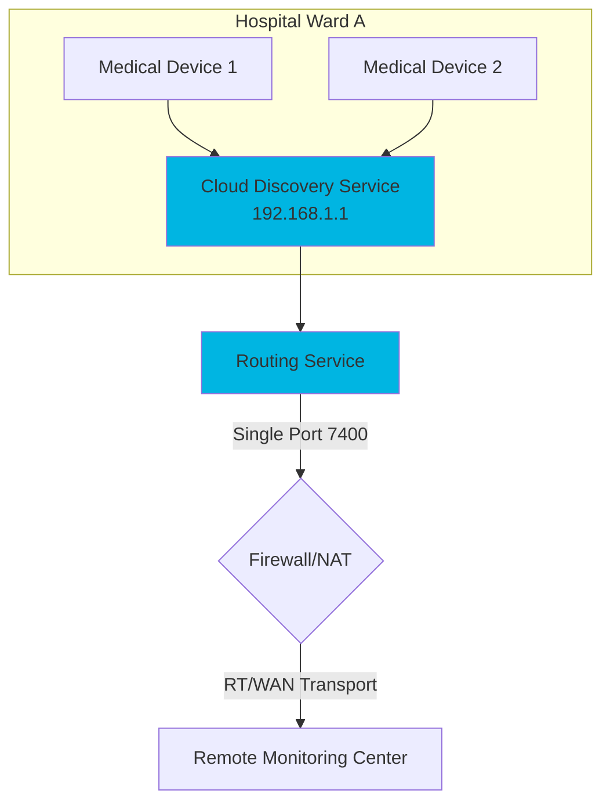

# RTI Connext Router Appliance

> **A hardware-based connectivity gateway that breaks through IT network constraints**

## What Is This?

This project demonstrates how to build a **Connext router appliance** using a BananaPi BPI-R3—a dedicated hardware device that solves the most common IT networking challenges in restricted environments like hospitals, factories, or secure facilities.

The appliance addresses four critical constraints identified in this [RTI blog post](https://www.rti.com/blog/top-3-tips-to-break-through-hospital-it-silos-with-connext):
- 🚫 **Multicast prohibition** - Networks that block multicast discovery
- 🔌 **Port exhaustion** - Strict limits on open firewall ports  
- 🔥 **Complex firewalls** - NAT and blocked inbound connections
- 🔒 **Security rigidity** - Zero-trust requirements and audit compliance

## Who Should Read This?

This guide is designed for:

- **Systems Engineers** deploying DDS applications in restricted networks
- **DevOps Teams** managing connectivity infrastructure  
- **Network Architects** evaluating solutions for IT-constrained environments
- **RTI Connext Users** seeking real-world deployment patterns

**Prerequisites:**
- Basic understanding of DDS and RTI Connext
- Familiarity with Linux system administration
- Network configuration experience

## Quick Start: Choose Your Path

| I want to... | Go to... | Time Required |
|--------------|----------|---------------|
| **Understand the concepts** | Continue reading below ⬇️ | 10 minutes |
| **Build the appliance hardware** | [Router Build Guide](router/README.md) | 2-3 hours |
| **Test the examples** | [Examples Overview](examples/README.md) | 1-2 hours per example |

---

## How It Works: The Four-Layer Solution

In a hospital or enterprise environment where IT departments apply restrictive network policies, this appliance acts as a transformative "bridge" that enables complex distributed systems to function without requiring IT to reconfigure their entire network.

### 1. Breaking the Multicast Barrier (Cloud Discovery Service)
Traditional DDS discovery relies on UDP Multicast (the "shout-and-listen" method). However, hospital IT often disables multicast to prevent network congestion.
* **The Problem:** Without multicast, applications can’t "see" each other to start communicating.
* **The Appliance Solution:** By hosting the **Cloud Discovery Service (CDS)**, your appliance acts as a "rendezvous point." Instead of shouting to the whole network, applications simply check in with the appliance (via unicast) to find their peers.
* **Transformative Impact:** It enables dynamic discovery in a "Zero-Multicast" environment without requiring you to manually hardcode every IP address in the system.

### 2. Solving Port Exhaustion (Routing Service)
Standard DDS assigns unique ports to every application (DomainParticipant), which can quickly consume hundreds of ports—something IT departments strictly forbid.
* **The Problem:** IT may only grant you a single open port (e.g., port 7400) to communicate between wards or floors.
* **The Appliance Solution:** The **Routing Service** acts as a "fanout node" or aggregator. It collects all DDS traffic from the local subnet and tunnels it through a single, predetermined port to the remote destination. 
* **Transformative Impact:** You can scale to dozens of devices locally while appearing as only **one connection** to the IT firewall, drastically reducing the "surface area" you need to negotiate with IT.

### 3. Navigating Complex Firewalls (Real-Time WAN Transport)
Hospitals often use Network Address Translation (NAT) and strict firewalls that block incoming connections, preventing remote monitoring or telemedicine.
* **The Problem:** Even if you have the IP, the firewall will drop packets that it didn't specifically "ask for."
* **The Appliance Solution:** The **RT/WAN transport** uses UDP hole punching. It allows the appliance to establish a peer-to-peer connection through the firewall by "punching" a path out that the remote side can then use to talk back.
* **Transformative Impact:** It provides **VPN-like connectivity without the overhead or latency of a VPN**, allowing real-time data to flow across different network segments securely and reliably.

### 4. Security Without Compromise (Connext Secure)
IT departments are often hesitant to allow data bridging because of "lateral movement" risks (the fear that a breach in one device leads to the whole network).
* **The Problem:** Standard network security (like a VPN) is "all or nothing"—once you're in, you can see everything.
* **The Appliance Solution:** **Connext Secure** provides fine-grained, data-centric security. It encrypts and authenticates individual "Topics" (specific data streams).
* **Transformative Impact:** Even though your appliance is bridging the network, it enforces a **Zero-Trust** model. You can prove to IT that the appliance *only* forwards "Heart Rate" data and strictly blocks any unauthorized commands, satisfying even the most rigid cybersecurity audits.

---

## Summary: What the Appliance Delivers

| IT Constraint | Appliance Component | How It Transforms Your Network |
| :--- | :--- | :--- |
| 🚫 **No Multicast** | Cloud Discovery Service | Moves discovery from "broadcast shouting" to "directory lookup" |
| 🔌 **Limited Ports** | Routing Service | Consolidates dozens of data streams into a single managed port |
| 🔥 **NAT/Firewalls** | RT/WAN Transport | Enables peer-to-peer traffic through firewalls without VPN overhead |
| 🔒 **Cybersecurity** | Connext Secure | Provides fine-grained, auditable control over exactly what data crosses boundaries |

> **💡 The Result:** A "plug-and-play" network connectivity appliance you can deploy in restricted environments to create a high-performance, secure data bus—without requiring IT to reconfigure their infrastructure.

---

## Architecture Overview

---

## Next Steps

### 🔧 Build the Appliance
Ready to create your own router? Follow the comprehensive build guide:

**→ [Router Build Instructions](router/README.md)**

Learn how to:
- Flash and configure the BananaPi BPI-R3
- Set up unified networking (wired + wireless)
- Deploy RTI Connext components
- Configure systemd services

**Time Required:** 4-6 hours (including 2-3 hours for image build) | **Difficulty:** Intermediate

---

### 🧪 Test the Examples
Explore hands-on examples demonstrating each capability:

**→ [Examples Overview](examples/README.md)**

Work through four progressive examples:
1. **Cloud Discovery Service** - Zero-multicast discovery (15-20 min)
2. **Routing Service** - Port aggregation and WAN gateways (20-30 min)
3. **Real-Time WAN Transport** - NAT traversal and remote connectivity (20-30 min)
4. **Security** - Authentication, encryption, and access control (30-40 min)

**Total Time:** 1.5-2 hours | **Difficulty:** Beginner to Intermediate

---

## Additional Resources

- **RTI Blog Post:** [Breaking Through Hospital IT Silos](https://www.rti.com/blog/top-3-tips-to-break-through-hospital-it-silos-with-connext)
- **RTI Documentation:** [Connext Professional](https://community.rti.com/documentation)
- **Hardware:** [BananaPi BPI-R3 Documentation](https://docs.banana-pi.org/en/BPI-R3/BananaPi_BPI-R3)

---

## Support

For questions about this project or RTI Connext Professional, visit:
- [RTI Community Portal](https://community.rti.com)
- [RTI Support](https://www.rti.com/support)
