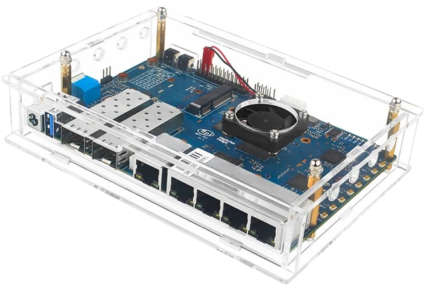
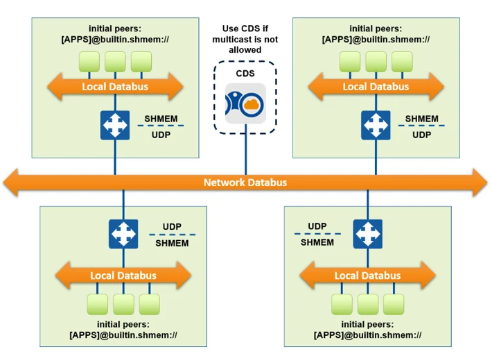
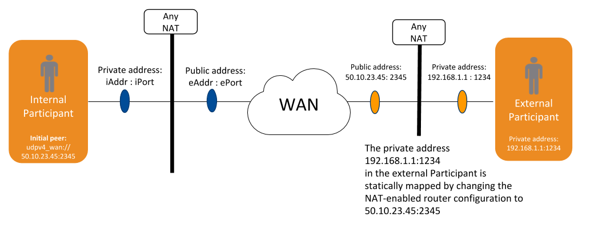
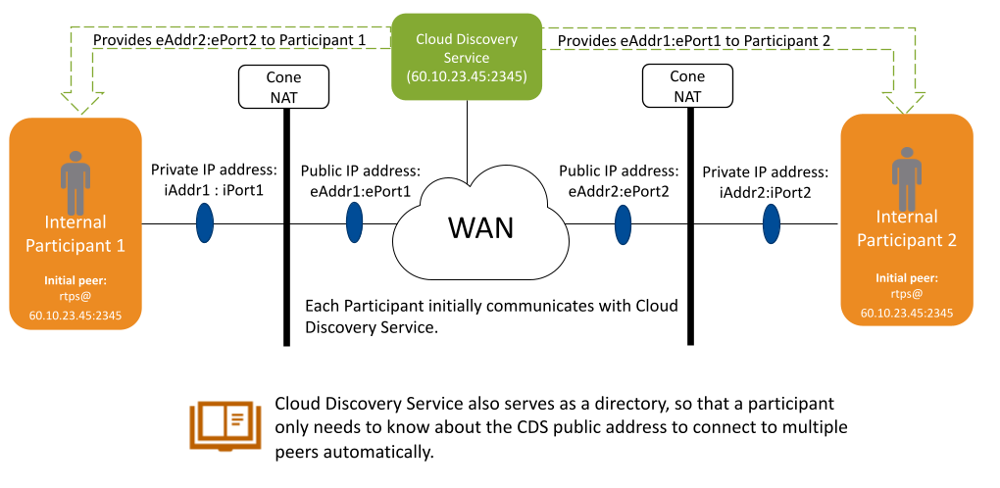
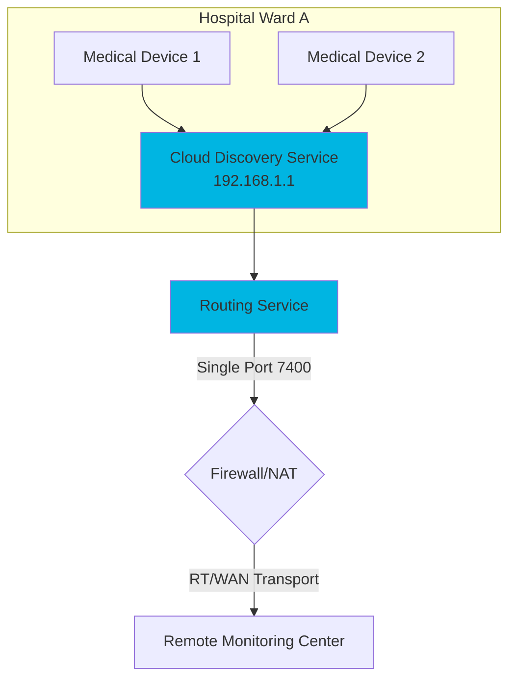

# RTI Connext Router Appliance

> **A hardware-based connectivity gateway that breaks through IT network constraints**



## What Is This?

This project demonstrates how to build a **Connext router appliance** using a BananaPi BPI-R3—a dedicated hardware device that solves the most common IT networking challenges in restricted environments like hospitals, factories, or secure facilities.

> **Not just for hospitals:** The constraints described below — no multicast, strict port budgets, NAT/firewalled segments, and zero-trust security requirements — show up anywhere an OT or IT team locks down the network: industrial control systems on a factory floor, SCADA and substation networks in microgrids and energy distribution, secure government or defence facilities, rail signalling, and building management systems, among others. The worked examples in this guide use a hospital network as the running scenario because that's the context of the source blog post below, but the appliance and the underlying RTI Connext components are domain-agnostic. Wherever a hospital-specific example appears, a parallel example from another restricted environment is suggested alongside it.

The appliance addresses four critical constraints identified in this [RTI blog post](https://www.rti.com/blog/top-3-tips-to-break-through-hospital-it-silos-with-connext):
- 🚫 **Multicast prohibition** - Networks that block multicast discovery
- 🔌 **Port exhaustion** - Strict limits on open firewall ports  
- 🔥 **Complex firewalls** - NAT and blocked inbound connections
- 🔒 **Security rigidity** - Zero-trust requirements and audit compliance

## Who Should Read This?

This guide is designed for:

- **Systems Engineers** deploying DDS applications in restricted networks
- **DevOps Teams** managing connectivity infrastructure  
- **Network Architects** evaluating solutions for IT-constrained environments
- **RTI Connext Users** seeking real-world deployment patterns

**Prerequisites:**
- Basic understanding of DDS and RTI Connext
- Familiarity with Linux system administration
- Network configuration experience

## Quick Start: Choose Your Path

| I want to... | Go to... | Time Required |
|--------------|----------|---------------|
| **Understand the concepts** | Continue reading below ⬇️ | 30 minutes |
| **Build the appliance hardware** | [Router Build Guide](router/README.md) | 2-3 hours |
| **Test the examples** | [Examples Overview](examples/README.md) | 1-2 hours per example |

---

## How It Works: The Four-Layer Solution

In a hospital or enterprise environment where IT departments apply restrictive network policies, this appliance acts as a transformative "bridge" that enables complex distributed systems to function without requiring IT to reconfigure their entire network.

> *Equivalent scenario:* swap "hospital IT" for the SCADA/OT network team at a factory or substation, the network security office at a defence facility, or the operator of a microgrid control network — the same restrictive posture, and the same appliance solution, applies.

### 1. DDS Discovery in Hospital Networks: The Multicast Problem and CDS Solution

#### tl;dr - Breaking the Multicast Barrier (Cloud Discovery Service)
> Traditional DDS discovery relies on UDP Multicast (the "shout-and-listen" method). However, hospital IT often disables multicast to prevent network congestion.
> * **The Problem:** Without multicast, applications can’t "see" each other to start communicating.
> * **The Appliance Solution:** By hosting the **Cloud Discovery Service (CDS)**, the appliance acts as a "rendezvous point." Instead of shouting to the whole network, applications simply check in with the appliance (via unicast) to find their peers.
> * **Transformative Impact:** It enables dynamic discovery in a "Zero-Multicast" environment without requiring you to manually hardcode every IP address in the system.


#### Why Multicast Is Blocked in Hospitals
Traditional DDS discovery uses UDP multicast as its default mechanism — essentially a "shout-and-listen" approach where every application broadcasts its presence and listens for others doing the same. In most general-purpose networks this works well, but hospital IT environments are a different story.

Multicast is routinely disabled in clinical networks for two reasons. First, **security**: multicast traffic is inherently harder to audit and control than unicast, since a single packet reaches many destinations simultaneously — an uncomfortable property on a network carrying protected health information. Second, **reliability**: uncontrolled multicast traffic can contribute to congestion on the very infrastructure that supports critical medical systems where dropped packets or added latency can have real consequences.
The side-effect of disabling multicast is that standard DDS discovery simply stops working. Applications go deaf to each other. Without a mechanism to find peers, the DDS databus can't form, and your distributed system never gets off the ground.

> *Non-hospital equivalent:* a factory automation network behaves the same way. Plant IT/OT teams disable multicast on the production VLAN to keep the PLC and SCADA traffic auditable and to stop broadcast storms from interfering with time-sensitive control loops — the same "applications go deaf to each other" failure mode applies the moment multicast discovery is switched off.

#### The Naïve Workaround — and Why It Doesn't Scale
The blunt-force fix is to statically configure ```NDDS_DISCOVERY_PEERS``` (or the XML equivalent) with the explicit IP address of every participant in the system. This works, but it's brittle: every time a node is added, moved, or replaced, someone has to update configuration files across potentially dozens of applications. This can work well in highly static environments, but in a medical device context under IEC 62304, that kind of change carries a documentation and validation burden you'd rather avoid.
Traditional DDS discovery relies on UDP Multicast (the "shout-and-listen" method). However, hospital IT often disables multicast to prevent network congestion.

> *Non-hospital equivalent:* in a rail signalling or industrial control context governed by IEC 61508/61511 functional safety standards, the same static-peers workaround triggers an equivalent re-validation and change-control burden every time a node changes — the regulatory framework differs, but the brittleness and paperwork cost are the same.

#### RTI Cloud Discovery Service: A Smarter Rendezvous
RTI Cloud Discovery Service (CDS) solves this elegantly. It is a lightweight standalone process — or optionally a library linked directly into an existing application — that acts as a **unicast rendezvous point**. The only thing each DDS participant needs to know is the IP address or DNS hostname of the CDS instance. From there, the process is automatic:

1. Each application sends its standard DDS discovery announcements to CDS via unicast rather than broadcasting them to the subnet.
2. CDS relays those discovery messages to all other registered participants.
3. Once two applications have discovered each other, they establish a **direct point-to-point unicast channel** and communicate without CDS being in the path.

This last point is important: CDS is a matchmaker, not a broker. It never touches user data — only the SPDP/SEDP discovery traffic. Once the system has converged and all participants know each other, CDS can go away entirely, and data flows with full DDS performance directly between endpoints.


<a href="https://www.rti.com/blog/top-3-tips-to-break-through-hospital-it-silos-with-connext?wvideo=1xz7r84b45" target="_blank" rel="noopener noreferrer"></a>


#### Deployment in Practice
CDS can run on any host with a static IP or DNS name — which is exactly what a dedicated appliance provides. Hosting CDS on the appliance means:

 - **Zero multicast required** anywhere on the hospital network.
 - **Single configuration touchpoint**: clinical applications only need one address in their initial_peers list (the appliance), not a full roster of every system node. That address can be set via environment variable, XML QoS profile, or in code — whichever fits the deployment model.
 - **Dynamic membership**: devices can join or leave the system at runtime. A new monitoring node comes online, checks in with CDS, gets introduced to its peers, and starts communicating — no manual reconfiguration, no redeployment.
 - **No impact on data path**: once discovery completes, all clinical data travels directly between applications over unicast, so there's no appliance bottleneck and no single point of failure for runtime data traffic.

> *Non-hospital equivalent:* picture a microgrid control network instead — inverters, battery management systems, and grid-tie controllers only need the appliance's address, can join or drop off the bus as new distributed energy resources come online, and exchange telemetry/setpoints directly over unicast once discovered.

#### The Net Result
What would otherwise be a fundamental infrastructure incompatibility between DDS and hospital networking policy becomes a non-issue. You deliver the full dynamic discovery and peer-to-peer communication capabilities of RTI Connext in an environment that has never supported multicast, with a configuration burden that is actually lower than the static-peers workaround — and with a deployment footprint that fits naturally onto an appliance you're already providing.

---

### 2. Port Management in Hospital Networks: The Firewall Problem and Routing Service Solution

#### tl;dr - Solving Port Exhaustion (Routing Service)
> Standard DDS assigns unique ports to every application (DomainParticipant), which can quickly consume hundreds of ports—something IT departments strictly forbid.
> * **The Problem:** IT may only grant you a single open port (e.g., port 7400) to communicate between wards or floors.
> * **The Appliance Solution:** The **Routing Service** acts as a "fanout node" or aggregator. It collects all DDS traffic from the local subnet and tunnels it through a single, predetermined port to the remote destination. 
> * **Transformative Impact:** You can scale to dozens of devices locally while appearing as only **one connection** to the IT firewall, drastically reducing the "surface area" you need to negotiate with IT.

#### Why Port Control Is So Strict in Hospitals
Hospital IT departments operate under a security posture that is fundamentally different from a typical enterprise environment. Every open port on a firewall is a potential attack surface, and in a regulated environment handling patient data, the justification for each one has to be explicit, documented, and approved. The standard process is straightforward in principle: you provide a list of the ports your system needs, IT creates the corresponding firewall rules, and communication is permitted.
The problem is that DDS was not designed with this workflow in mind.

> *Non-hospital equivalent:* a secure government or defence facility runs the identical process — every port request goes through a formal accreditation process (e.g. an ATO/RMF-style review), and an unbounded or unpredictable port footprint is just as much of a non-starter there as it is for a hospital's patient-data network.

#### How DDS Port Allocation Works — and Why It Breaks the Model
DDS assigns UDP ports deterministically based on a formula involving the Domain ID and the participant index of each DomainParticipant (DP). The practical consequence is that each DP in the system consumes its own set of ports — and as you add more DPs (more applications, more devices), the port count grows accordingly. A system with a dozen DomainParticipants can easily be consuming 30–50 ports or more across a range that is difficult to bound in advance.

This puts you in an uncomfortable position when the IT department asks: "*Give us a list of every port your system will use.*" In a static, fully-determined deployment you could enumerate them. But in a dynamic clinical environment where devices connect and disconnect, where the number of running applications fluctuates, the honest answer is: "*It depends on how many things are running at any given moment*" — which is not an answer hospital IT will accept.
Even if IT is willing to open a range of ports, that range represents ongoing negotiation overhead and a larger firewall footprint that increases with every new device you deploy. Scaling becomes a commercial and administrative problem, not just a technical one.

> *Non-hospital equivalent:* the same conversation plays out on a factory floor where cells and robots are added or reconfigured over a product line's lifetime, or on a microgrid where new inverters and sensors come online as capacity expands — an open-ended port range is just as unacceptable to a plant network engineer or grid operator as it is to hospital IT.

#### The Layered Databus Approach with RTI Routing Service

RTI's solution is to fundamentally change the architecture so that the port-proliferation problem never reaches the hospital network boundary. The mechanism is a **fanout node** running RTI Routing Service on each host, implementing what RTI refers to as a layered databus architecture.

The key insight is to split communication into two distinct layers with different transports:

- **Local layer — shared memory (SHMEM)**: Applications on the same host communicate with each other exclusively over shared memory. A SHMEM DomainParticipant uses no UDP ports whatsoever. From the network's perspective, inter-application traffic on a single host is invisible — it never touches the wire.
- **Wide-area layer — UDP unicast**: Routing Service creates a single UDP DomainParticipant that acts as the gateway between the local SHMEM domain and the rest of the network. This single participant consumes a fixed, known number of UDP ports: three when multicast is enabled (the standard default), or just two when multicast is disabled — which, as covered earlier, it almost always is in a hospital environment.

Routing Service bridges these two layers, collecting data from local applications via SHMEM and forwarding it outbound over those two UDP ports, and conversely receiving inbound traffic over UDP and delivering it locally via SHMEM.



#### What This Looks Like to Hospital IT
From the network and firewall perspective, the picture is transformed entirely:

- **Every host in the system appears as exactly two UDP ports**, regardless of how many DDS applications are running on it.
- You can give IT a **precise, static, bounded list of ports** at the point of deployment negotiation — two ports per host, predictable and permanent.
-Adding a new application to a host, or removing one, has **zero impact on the firewall rules**. The new application joins the local SHMEM domain, Routing Service handles the bridging, and IT sees nothing change.
-Scaling from five devices to fifty changes the number of hosts in the system, not the per-host port footprint. The conversation with IT becomes: "*We need two ports per host*" — a simple, repeatable ask.

> *Non-hospital equivalent:* the same fixed-footprint pitch works for a plant network engineer evaluating a new manufacturing cell, or a secure-facility network officer reviewing an access request — "two ports per host, regardless of how many sensors or PLCs sit behind it" is exactly as easy a sell there as it is to hospital IT.

#### Integration with Cloud Discovery Service
This architecture combines naturally with CDS. Routing Service's UDP DomainParticipant is the only thing that needs to perform wide-area discovery, and it can do so via CDS rather than multicast. The result is a system that simultaneously solves both of the hospital networking constraints covered here: zero multicast dependency, and a minimal, fixed, fully-auditable port footprint — regardless of the size or dynamism of the clinical application layer running beneath it.

---

### 3. WAN Connectivity in Hospital Networks: NAT Traversal and Real-Time WAN Transport

#### tl;dr - Navigating Complex Firewalls (Real-Time WAN Transport)
> Hospitals often use Network Address Translation (NAT) and strict firewalls that block incoming connections, preventing remote monitoring or telemedicine.
> * **The Problem:** Even if you have the IP, the firewall will drop packets that it didn't specifically "ask for."
> * **The Appliance Solution:** The **RT/WAN transport** uses UDP hole punching. It allows the appliance to establish a peer-to-peer connection through the firewall by "punching" a path out that the remote side can then use to talk back.
> * **Transformative Impact:** It provides **VPN-like connectivity without the overhead or latency of a VPN**, allowing real-time data to flow across different network segments securely and reliably.

#### The NAT and Firewall Reality in Healthcare Networks
Hospital networks are almost universally built around the assumption that traffic flows *inward by request, not inward by arrival*. NAT is the mechanism that enforces this at the IP layer: the hospital's router presents a single public IP address to the outside world, and internally maps connections to private addresses that are invisible and unreachable from outside. The firewall compounds this by maintaining stateful connection tables — it permits return traffic only for connections that originated from inside the network.

This is sound security practice, and hospital IT has no intention of relaxing it. The consequence for medical device vendors is significant: if the appliance is sitting inside a hospital network and you need to exchange data with a remote system — a central monitoring hub in another facility, a cloud analytics platform, a telemedicine endpoint — you cannot simply connect to it by IP. The remote system cannot initiate a connection inward through the NAT, and the firewall will silently drop any unsolicited inbound packets.

> *Non-hospital equivalent:* a remote oil & gas wellsite, an unmanned substation, or a distributed factory line sits behind exactly the same kind of NAT/firewall boundary — a central SCADA control room or a cloud-based fleet management platform faces the identical "can't dial inward" problem when it needs to reach a remote PLC or RTU.

The traditional answer to this problem is a VPN: establish an encrypted tunnel that makes the remote network appear local, bypassing the NAT and firewall constraints entirely. But VPNs introduce their own problems in a healthcare context. They require IT to provision and manage tunnel endpoints, they add encapsulation overhead that increases latency, and they are often implemented as all-or-nothing network-level constructs that sit uncomfortably with the zero-trust data security model described earlier. For real-time clinical data where latency budgets are tight, the added overhead of VPN encapsulation is a meaningful cost.

> *Non-hospital equivalent:* the same VPN trade-offs apply to a microgrid operator linking remote inverter sites back to a control centre, or a rail operator connecting trackside signalling equipment to a central control room — provisioning and maintaining VPN tunnels to every remote site is just as much of an IT burden, and the added latency is just as unwelcome for real-time control loops.

#### How NAT Traversal Actually Works
The technique underlying RTI's Real-Time WAN Transport is **UDP hole punching** — a well-established method for establishing peer-to-peer connectivity through NAT devices without requiring inbound firewall rules or VPN infrastructure. The mechanism works by exploiting how NAT tables are constructed. When a device inside a NAT sends a UDP packet outbound, the NAT router creates a table entry mapping the internal address and port to the external-facing address and port it used. Crucially, this entry permits return traffic from the destination: the NAT will let packets back in *if they arrive at the right external port from the right destination*. The "hole" is the NAT table entry created by the outbound packet.

If both endpoints punch outward simultaneously — coordinated by a rendezvous point they can both reach — each creates a NAT entry that permits the other's return traffic. The result is a direct peer-to-peer UDP path through both NATs with no persistent intermediary in the data path.



RTI's implementation handles this coordination through Cloud Discovery Service, which acts as the rendezvous point. Critically, **no third-party components are required** — no STUN servers, no SIP session establishment, no external infrastructure beyond CDS. The entire mechanism is native to the Connext ecosystem, using a single API and security model consistent with the rest of the platform.



#### What Real-Time WAN Transport Delivers
Beyond basic NAT traversal, RT/WAN Transport is designed specifically for the realities of WAN communication in distributed medical systems:

- **NAT traversal** is the foundational capability: DomainParticipants inside a hospital LAN behind NAT can communicate directly with participants on remote networks without requiring the hospital IT department to open inbound firewall rules or configure port forwarding. The connection is initiated outbound from the hospital side — a posture IT is comfortable with — and the resulting path supports bidirectional real-time data flow.
- **IP mobility** addresses a subtler but practically important problem: IP addresses are not always stable. Devices may roam between network segments, DHCP leases expire, or network transitions occur dur
ing long-running clinical sessions. RT/WAN Transport handles address changes in any participant without dropping the logical DDS connection, which matters considerably for applications that need to maintain continuous data streams across network events.
- **Security** is preserved end-to-end through integration with RTI Security Plugins. The encryption, authentication, and access control described in the previous section apply fully across the WAN transport. The security model does not change based on whether the underlying transport is LAN or WAN — the same Topic-level permissions, the same identity credentials, the same cryptographic enforcement. This is architecturally important: you are not adding WAN connectivity by punching a hole in your security posture, you are extending the same security model across a wider network boundary.

> *Non-hospital equivalent:* an unmanned ground vehicle or autonomous marine vessel roaming between coverage zones, or a mobile crane/AGV moving across a factory floor and switching network attachment points, sees the same IP-mobility benefit — RT/WAN Transport keeps the logical DDS connection alive across those address changes just as it would across a hospital's network transitions.

#### Why This Is Architecturally Superior to a VPN for Real-Time Data

A VPN solves the NAT problem by wrapping IP traffic in an encrypted tunnel between two fixed endpoints. For general-purpose enterprise connectivity this is an acceptable trade-off. For real-time medical data it introduces several constraints that RT/WAN Transport avoids:

The path through a VPN is fixed and managed at the network level. RT/WAN Transport establishes **direct peer-to-peer UDP paths** — once the hole is punched and discovery is complete, data travels the shortest available network path between endpoints with no additional encapsulation overhead. For time-sensitive physiological data, this matters.

VPNs grant broad network-level access to the tunnel participant. RT/WAN Transport, combined with Security Plugins, maintains **Topic-level access control** across the WAN boundary — the same deny-by-default permissions model applies whether the remote participant is on the same LAN or connecting from a different country. The WAN transport does not broaden the trust model; it extends the existing one.
VPN infrastructure requires ongoing management from IT: certificate rotation, tunnel monitoring, endpoint configuration. RT/WAN Transport requires only that CDS is reachable — a single, stable, easily managed endpoint — and handles the rest autonomously, including adaptation to IP changes and network transitions.

#### The Practical Outcome for Deployment
For the appliance, this means that WAN connectivity to remote monitoring platforms, central data aggregators, or cloud infrastructure can be achieved without requesting inbound firewall rules from hospital IT, without deploying VPN infrastructure, and without compromising the security model already established for local communication. The appliance punches outbound, establishes direct paths to its configured peers, and maintains real-time DDS communication across the WAN using exactly the same programming model, QoS configuration, and security policy as the local system.

From IT's perspective, the network behaviour is straightforward: the appliance initiates outbound UDP connections to a known, fixed endpoint (CDS), and subsequent traffic flows between pre-authenticated peers. There are no inbound connection requests, no broad network access grants, and no new infrastructure to manage on their side — which is precisely the kind of argument that moves a hospital IT approval process forward.

---

### 4. Data-Centric Security in Hospital Networks: Lateral Movement Risk and the Zero-Trust Solution

#### tl;dr - Security Without Compromise (Connext Secure)
> IT departmentsare often hesitant to allow data bridging because of "lateral movement" risks (the fear that a breach in one device leads to the whole network).
> * **The Problem:** Standard network security (like a VPN) is "all or nothing"—once you're in, you can see everything.
> * **The Appliance Solution:** **Connext Secure** provides fine-grained, data-centric security. It encrypts and authenticates individual "Topics" (specific data streams).
> * **Transformative Impact:** Even though the appliance is bridging the network, it enforces a **Zero-Trust** model. You can prove to IT that the appliance *only* forwards "Heart Rate" data and strictly blocks any unauthorized commands, satisfying even the most rigid cybersecurity audits.

#### Why Hospital IT Is Right to Be Nervous About Network Bridging

Healthcare delivery organisations are among the most targeted sectors for cyberattacks globally, and the consequences of a successful breach extend well beyond data theft. Ransomware that takes down a clinical network can delay surgeries, disable monitoring equipment, and directly endanger patients. This context shapes everything about how hospital IT evaluates connected medical devices — and it explains why the phrase "this device bridges two network segments" is met with profound scepticism.

The specific fear is **lateral movement**: the scenario where an attacker who compromises one device uses that foothold to traverse the network, escalating privileges and reaching systems far beyond the original entry point. A device that sits at a network boundary and actively forwards traffic is, from this perspective, the worst possible actor — a pre-built bridge for exactly that kind of movement.

Traditional network security tools don't help much here, because they operate at the wrong level of abstraction.

> *Non-hospital equivalent:* an industrial control network or microgrid SCADA system faces the same calculus — a ransomware or intrusion event that pivots from an IT bridge device into the OT network can halt production lines or destabilise power delivery, and a defence facility network officer is just as wary of any device that bridges classified and unclassified segments.

#### Why Perimeter Security Is Insufficient
A VPN or a traditional firewall works by controlling *who* can access a network segment — but once that access is granted, it is largely undifferentiated. A device that is "on the network" can, subject to routing rules, attempt to communicate with a wide range of endpoints and services. Firewall rules can restrict this to some extent, but they operate on IP addresses and port numbers: they have no visibility into *what the data is, what it means, or whether this specific application should be allowed to read or write it.*

This creates a fundamental problem for medical device vendors. You can tell IT: "*The firewall only allows traffic on port X from host Y.*" But you cannot tell them: "*Even if this device is compromised, an attacker cannot use it to issue commands to a ventilator, because the security enforcement is inside the data layer itself, not just at the network perimeter.*" That second statement is what a rigorous security audit actually needs, and traditional approaches cannot support it.

> *Non-hospital equivalent:* substitute "issue commands to a ventilator" with "issue commands to a safety PLC" on a factory floor, "open a circuit breaker" on a microgrid, or "alter a signalling interlock" on a rail network — the same data-layer guarantee, that a compromised bridging device still cannot exceed its cryptographically granted permissions, is the argument every one of those operators needs to hear.

#### DDS-Security: Security at the Data Layer
RTI Security Plugins implement the OMG DDS-Security specification to move security enforcement from the network perimeter down into the data communication layer itself. The result is what RTI describes as **data-centric security** — controls that are attached to the data and enforced at the point of production and consumption, regardless of what the network topology looks like.

The architecture is built around five security pillars, each addressing a distinct threat vector:
- **Confidentiality** — Data on specific Topics is encrypted, so even if traffic is intercepted at the network level, its contents are unreadable without the appropriate credentials. Encryption can be applied selectively: high-volume sensor telemetry can be left unencrypted for performance reasons while command and control Topics are fully protected.
- **Integrity** — Message authentication codes ensure that data has not been tampered with in transit. A receiver can cryptographically verify that the payload it received is exactly what the sender produced.
- **Authenticity** — Every DomainParticipant must present a valid identity credential (via PKI) before it is permitted to join the system. Unauthenticated participants are ignored entirely — they cannot even discover that other participants exist.
- **Access Control** — This is the critical pillar for the lateral movement concern. Permissions are defined per identity, per Topic, and per operation (publish or subscribe). A participant that is authenticated as a vital signs monitor is permitted to publish on `HeartRate` and `SpO2` but is cryptographically prevented from subscribing to `VentilatorSettings` or publishing on `InfusionPumpCommand`. These rules are enforced by the middleware itself, not by a network device that can be bypassed.
- **Availability** — The security architecture is designed not to become a bottleneck. Selective encryption and efficient key management mean that security overhead does not compromise the real-time performance properties that medical applications require.

> *Non-hospital equivalent:* on a factory floor, the same Access Control model would let a temperature sensor publish on `OvenTemperature` while being cryptographically barred from publishing on `ConveyorSpeedCommand` or `EmergencyStop`; on a microgrid, a weather station could be permitted to publish `IrradianceReading` but blocked from writing to `InverterSetpoint`. The Availability guarantee carries over the same way — security overhead stays low enough not to compromise the real-time control loops these systems depend on.

#### Deny-by-Default: What Zero-Trust Actually Means Here
The term "zero-trust" is widely used but often poorly understood. In RTI's architecture it has a specific and verifiable meaning: **the default permission for any communication is deny**, and explicit grants are required for every Topic, every direction, and every identity. There is no implicit trust conferred by being "on the network" or even by being authenticated as a valid system participant.

For the appliance, this means the following can be stated — and demonstrated — to a hospital IT security team:

- The appliance's Routing Service instance holds credentials that explicitly permit it to subscribe to a defined set of clinical Topics and republish them on the remote segment.
- Those permissions are encoded in signed governance and permissions documents that the middleware enforces cryptographically.
- Even if an attacker were to fully compromise the appliance operating system and attempt to inject traffic on an unauthorised Topic, the receiving participants would reject it — because the appliance's credentials do not grant publish permission on that Topic, and the receiving middleware enforces this before the data reaches the application layer.
- Configuration of these controls requires little or no modification to existing application code, meaning the security posture can be applied to an existing system without a rearchitecting effort.

> *Non-hospital equivalent:* the identical bullet list holds for a factory security review, substituting "a defined set of clinical Topics" for "a defined set of process telemetry Topics," or for a secure facility, substituting it for "a defined set of sensor and access-control Topics" — the cryptographic guarantee doesn't change with the industry.

#### The Audit Conversation This Makes Possible
Standard network security gives you a perimeter argument: "*We've restricted what can reach the device.*" DDS-Security gives you a data argument: "*We've restricted what the device can do with data, cryptographically, even if the perimeter fails.*" These are categorically different claims, and the second is what a post-breach threat model — which is how serious security audits are now conducted — actually demands.

You can present IT and compliance teams with signed, human-readable permissions documents that enumerate exactly which Topics the appliance can read and write, in which direction, between which network segments. That is not a claim about firewall rules that might be misconfigured or bypassed — it is a cryptographically enforced policy that is auditable, versionable, and demonstrably aligned with the zero-trust guidance published by bodies such as H-ISAC for healthcare network security.

In an environment where connected medical devices are increasingly viewed as a liability by hospital security teams, the ability to make that argument concretely is a significant commercial differentiator.

> *Non-hospital equivalent:* the equivalent reference frameworks differ by sector — NIST SP 800-82 and IEC 62443 for industrial control systems, NERC CIP for grid/microgrid operators, or relevant national defence accreditation standards for secure facilities — but the same signed, auditable permissions document satisfies the equivalent zero-trust requirement in each case, and connected OT devices are viewed with the same liability lens by those security teams as connected medical devices are by hospital security teams.

---

## Summary: What the Appliance Delivers

| IT Constraint | Appliance Component | How It Transforms Your Network |
| :--- | :--- | :--- |
| 🚫 **No Multicast** | Cloud Discovery Service | Moves discovery from "broadcast shouting" to "directory lookup" |
| 🔌 **Limited Ports** | Routing Service | Consolidates dozens of data streams into a single managed port |
| 🔥 **NAT/Firewalls** | RT/WAN Transport | Enables peer-to-peer traffic through firewalls without VPN overhead |
| 🔒 **Cybersecurity** | Connext Secure | Provides fine-grained, auditable control over exactly what data crosses boundaries |

> **💡 The Result:** A "plug-and-play" network connectivity appliance you can deploy in restricted environments to create a high-performance, secure data bus—without requiring IT to reconfigure their infrastructure.

---

## Architecture Overview

> *Non-hospital equivalent:* the diagram below uses a hospital ward and remote monitoring centre as the running example; swap in "Factory Cell A" → "Central SCADA Server," or "Substation A" → "Grid Control Centre," and the architecture is unchanged.


---

## Next Steps

### 🔧 Build the Appliance
Ready to create your own router? Follow the comprehensive build guide:

**→ [Router Build Instructions](router/README.md)**

Learn how to:
- Flash and configure the BananaPi BPI-R3
- Set up unified networking (wired + wireless)
- Deploy RTI Connext components
- Configure systemd services

**Time Required:** 4-6 hours (including 2-3 hours for image build) | **Difficulty:** Intermediate

---

### 🧪 Test the Examples
Explore hands-on examples demonstrating each capability:

**→ [Examples Overview](examples/README.md)**

Work through four progressive examples:
1. **Cloud Discovery Service** - Zero-multicast discovery (15-20 min)
2. **Routing Service** - Port aggregation and WAN gateways (20-30 min)
3. **Real-Time WAN Transport** - NAT traversal and remote connectivity (20-30 min)
4. **Security** - Authentication, encryption, and access control (30-40 min)

**Total Time:** 1.5-2 hours | **Difficulty:** Beginner to Intermediate

---

## Additional Resources

- **RTI Blog Post:** [Breaking Through Hospital IT Silos](https://www.rti.com/blog/top-3-tips-to-break-through-hospital-it-silos-with-connext)
- **RTI Documentation:** [Connext Professional](https://community.rti.com/documentation)
- **Hardware:** [BananaPi BPI-R3 Documentation](https://docs.banana-pi.org/en/BPI-R3/BananaPi_BPI-R3)

---

## Support

For questions about this project or RTI Connext Professional, visit:
- [RTI Community Portal](https://community.rti.com)
- [RTI Support](https://www.rti.com/support)
