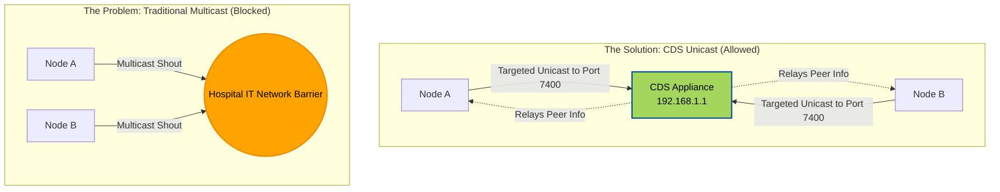
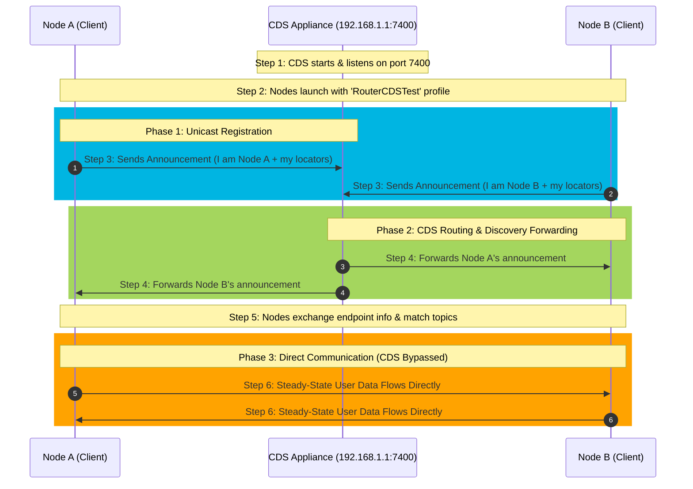
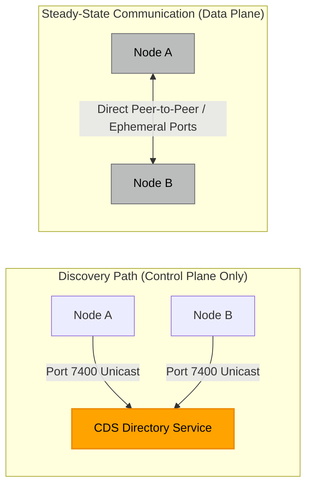

# Example 1: Cloud Discovery Service (CDS)

> **Breaking the multicast barrier in zero-multicast networks**

⏱️ **Time Required:** 15-20 minutes  
📊 **Difficulty:** Beginner  
🔗 **Prerequisites:** None (standalone example)  
📍 **You are here:** Phase 1 of 4 → Local Network Optimization

---

## 📋 TL;DR

**What you'll accomplish:** Configure DDS applications to discover each other without multicast using Cloud Discovery Service as a rendezvous point.

**Key takeaway:** CDS acts like a "phone directory" for DDS participants—instead of shouting to everyone on the network (multicast), applications simply check in with CDS to find their peers.

---

## What You'll Learn

By the end of this example, you'll understand:
- ✅ How DDS discovery works without multicast
- ✅ Configuring participants to use unicast discovery through CDS
- ✅ The role of CDS in the discovery vs. data plane
- ✅ How to verify discovery using QoS profiles

---

## The Challenge

Traditional DDS discovery relies on UDP Multicast (the "shout-and-listen" method). However, hospital IT often disables multicast to prevent network congestion.

**The problem:** Without multicast, applications can't "see" each other to start communicating.

## The Solution

By hosting **Cloud Discovery Service (CDS)** on your appliance, it acts as a "rendezvous point." Instead of shouting to the whole network, applications simply check in with the appliance (via unicast) to find their peers.

> **💡 Key Concept:** CDS is **only for discovery**, not data transfer. Once nodes find each other, they communicate directly peer-to-peer.

## How It Works: Problem vs. Solution



---

## Understanding the Configuration

This example demonstrates unicast UDPv4 discovery through Cloud Discovery Service (CDS) instead of multicast discovery.

**How it works:**
1. The nodes use [Client/USER_QOS_PROFILES.xml](Client/USER_QOS_PROFILES.xml) to configure their DomainParticipant discovery behavior
2. The CDS process uses [Router/cds.xml](Router/cds.xml) to configure where it listens for participant announcements
3. Nodes do NOT discover each other directly at startup
4. Instead, each node sends its participant announcements to CDS at `192.168.1.1:7400`
5. CDS receives those announcements and forwards discovery information so nodes can learn about each other
6. Once discovery is complete, applications communicate directly—CDS is NOT in the user-data path

---

## Configuration Deep Dive

### Client Configuration: qos.xml

the [Client/qos.xml](qos.xml) defines one QoS library and one profile:

 - Library: CDSQoSLib
 - Profile: RouterCDSTest

```xml
<qos_profile name="RouterCDSTest">
  <domain_participant_qos>
    <transport_builtin>
      <mask>UDPv4</mask>
      <udpv4>
        <multicast_enabled>false</multicast_enabled>
      </udpv4>
    </transport_builtin>

    <discovery>
      <initial_peers>
        <element>rtps@udpv4://192.168.1.1:7400</element>
      </initial_peers>
      <multicast_receive_addresses />
    </discovery>
  </domain_participant_qos>
</qos_profile>
```

#### Meaning of each part
1. transport_builtin/mask = UDPv4

This enables only the builtin UDPv4 transport for the participant. So the node will use UDPv4 for discovery and user data, not SHMEM or UDPv6. This is consistent with the Connext discovery configuration model for DomainParticipants.

2. udpv4/multicast_enabled = false

This disables UDPv4 multicast on the participant.

So the node will not use multicast discovery traffic. That matters because Connext normally relies on multicast by default in many LAN cases, but here you are explicitly turning that off.

3. discovery/initial_peers

This is the key line:
```xml
<element>rtps@udpv4://192.168.1.1:7400</element>
```
This tells the participant:

 - send discovery announcements to an RTPS peer
 - using UDPv4
 - at host 192.168.1.1
 - port 7400

The CDS documentation explicitly describes this pattern: if CDS is configured with UDPv4 and a receive port, applications can contact it by adding rtps@udpv4://<CDS-host>:<port> to initial_peers.

4. multicast_receive_addresses /

This empty tag clears the multicast receive list.

That means the participant will not listen for multicast discovery traffic either. Combined with multicast_enabled=false, this makes the node discovery effectively unicast-only, with CDS as the known discovery peer.

### What the cds.xml does

[Router/cds.xml](cds.xml)

```xml
<dds xmlns:xsi="http://www.w3.org/2001/XMLSchema-instance"
    xsi:noNamespaceSchemaLocation="https://community.rti.com/schema/7.3.1/rti_cloud_discovery_service.xsd">

    <cloud_discovery_service name="CDS">
        <transport>
            <element>
                <alias>builtin.udpv4</alias>
                <receive_port>7400</receive_port>
            </element>
        </transport>
    </cloud_discovery_service>
</dds>
```

#### Meaning of each part
1. cloud_discovery_service name="CDS"

This defines one CDS instance named CDS.

2. transport/element/alias = builtin.udpv4

This tells CDS to use the builtin UDPv4 transport which means CDS will receive discovery traffic over normal UDPv4, not UDPv4_WAN, TCP, or TLS.

3. receive_port = 7400

This tells CDS to listen on UDP port 7400 for participant announcements.

### How the nodes and CDS interact



#### Step 1: CDS starts

CDS starts first and binds to:

 - transport: UDPv4
 - port: 7400

So it is listening on 192.168.1.1:7400 assuming that is the machine/interface address reachable by the nodes.

#### Step 2: each node starts with RouterCDSTest

Each node creates a DomainParticipant using the RouterCDSTest profile.

That participant is configured to:

 - use UDPv4 only
 - not use multicast
 - send discovery traffic to rtps@udpv4://192.168.1.1:7400

#### Step 3: node sends participant announcements to CDS

Each node periodically sends its participant discovery announcements to the peer in initial_peers, which is CDS.

This is how CDS learns:

 - the participant exists
 - its domain
 - its locators/endpoints needed for discovery continuation

#### Step 4: CDS forwards participant announcements

CDS’s forwarder maintains discovery state and forwards participant announcements to other peer DomainParticipants so they can discover each other.

This is the core CDS role: it acts like a directory/forwarder for participant discovery.

#### Step 5: nodes discover each other

After CDS relays the participant information:

 - Node A learns about Node B
 - Node B learns about Node A
 - endpoint discovery proceeds
 - matching DataWriters/DataReaders can occur if topic/type/QoS are compatible

#### Step 6: user data flows directly between nodes

With this UDPv4 CDS setup, CDS is used for discovery, not as a user-data relay.

The CDS tutorials explicitly note that after discovery completes, applications continue communicating even if CDS is stopped. That means CDS is not in the steady-state user-data path for this pattern.

### How discovery happens in this setup
#### Without CDS

Normally on a LAN, Connext often uses:

 - multicast send to a discovery multicast group
 - multicast receive on that group
 - plus loopback/shared memory defaults

#### With this configuration

We have disabled that behavior:

 - no multicast sending
 - no multicast receiving
 - only one explicit initial peer: CDS

So discovery becomes:

 - each participant knows only CDS initially
 - each participant announces itself to CDS
 - CDS relays participant information
 - participants then know each other

An important Connext rule is that participants do not exchange peer lists with each other. So Node A knowing CDS and Node B knowing CDS does not mean A directly learns B from B’s peer list. Instead, CDS is the component that receives and forwards the participant announcements.

#### Will the nodes discover each other directly?



Not initially.
They are configured to contact CDS, not each other.

After CDS forwards discovery information, they can establish direct DDS communication.

So the answer is:

 - initial discovery path: node → CDS
 - post-discovery communication path: node ↔ node

#### Why this works even though the nodes only list CDS in initial_peers

Because initial_peers is only the list of places a participant first sends discovery announcements. It is not the full set of all participants it will ever know.

CDS receives those announcements and forwards them to other participants, allowing them to discover one another.

#### Important assumptions and caveats
1. Same DDS domain

Your qos.xml only defines participant QoS, not the domain ID. The nodes must still create participants in the same DDS domain if they are expected to discover and communicate with each other. Participants in different domains will not communicate.
2. CDS must be reachable

All nodes must be able to send UDP traffic to:

 - 192.168.1.1
 - port 7400

If a firewall blocks UDP/7400, discovery will fail.
3. 192.168.1.1 must be the CDS host

The qos.xml assumes CDS is reachable at 192.168.1.1. If CDS runs elsewhere, the initial_peers entry must be changed.
4. This is LAN-style UDPv4 CDS, not WAN CDS

This configuration uses:

`<alias>builtin.udpv4</alias>`

not:

`<alias>builtin.udpv4_wan</alias>`

So this is a LAN/unicast UDPv4 CDS configuration, not a Real-Time WAN Transport/NAT traversal configuration.

5. Multicast is intentionally disabled

This is useful in multicast-less or controlled networks, but it means CDS is now the discovery rendezvous point. If CDS is down at startup, new participants may not discover each other.

### In plain English

Think of CDS as a phone directory:

 - each node knows the phone number of the directory service (192.168.1.1:7400)
 - each node calls the directory and says “I’m here”
 - CDS tells the other nodes “here are the participants you should know about”
 - once the nodes have each other’s contact info, they talk directly

That is why CDS is often described as a discovery service for multicast-less environments.
---

## ✅ Testing & Verification

### What Success Looks Like

After completing this example, you should observe:
1. **CDS service running** on the appliance at `192.168.1.1:7400`
2. **Participants discover each other** within 5-10 seconds
3. **Direct data flow** between participants (verify CDS is not in data path)
4. **Mo Multicast** Verify using wireshark

### Testing Steps

1. **Start CDS on the appliance:**
   ```bash
   rticlouddiscoveryserviceapp -cfgFile Router/cds.xml -cfgName CDS
   ```

2. **Launch first client** (Node A):
   ```bash
   rtiddsspy -cfgFile Client/USER_QOS_PROFILES.xml -cfgName CDSQoSLib::RouterCDSTest -domainId 0
   ```

3. **Launch second client** (Node B) from another terminal:
   ```bash
   rtiddsspy -cfgFile Client/USER_QOS_PROFILES.xml -cfgName CDSQoSLib::RouterCDSTest -domainId 0
   ```

4. **Verify discovery:** Both `rtiddsspy` instances should show:
   - 2 participants discovered
   - Endpoint information exchanged

---

### Testing with Shapes Demo
   
```bash
rtishapesdemo -configure
```
 - Stop the particiapant
 - Click "Manage QoS"
 - Add the Client/USER_QOS_PROFILES.xml file 
 - Click OK to close the dialog and save the included QoS file list
 - Choose the profile: "CDSQoSLib::RouterCDSTest" from the dropdown of configured QoS profiles
 - Select a domain ID (this must be the same as the other participants)
 - Click Start

---

## 🔧 Troubleshooting

| Problem | Possible Cause | Solution |
|---------|---------------|----------|
| Participants don't discover | CDS not reachable | Verify `ping 192.168.1.1` works; check firewall allows UDP/7400 |
| "No participants found" | Wrong domain ID | Ensure all participants use same domain ID (default: 0) |
| CDS won't start | Port already in use | Check if port 7400 is available: `netstat -an \| grep 7400` |
| Discovery works but no data | QoS mismatch | Verify topic names and QoS policies match between reader/writer |

### Common Mistakes

- ❌ Forgetting to disable multicast in `qos.xml`
- ❌ Using wrong IP address for CDS (must match the appliance IP)
- ❌ Mixing up domain IDs between participants
- ❌ Expecting CDS to relay user data (it only relays discovery info)

---

## 📚 Key Takeaways

- ✅ CDS enables discovery without multicast
- ✅ CDS is **only** for discovery, not user data
- ✅ After discovery, participants communicate peer-to-peer
- ✅ `initial_peers` points to CDS, not to other participants
- ✅ All participants must use the same DDS domain

---

## What's Next?

**→ Continue to [Example 2: Routing Service](../2.%20Routing%20Service/README.md)**

Learn how to aggregate multiple local participants onto a single WAN port using Routing Service.

[← Back to Examples](../README.md) | **Connext Router Appliance Examples**