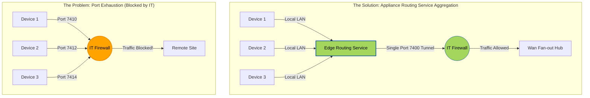
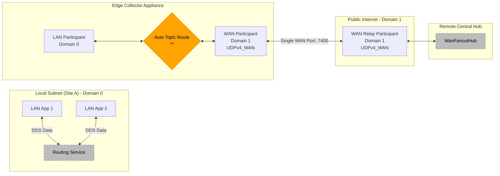
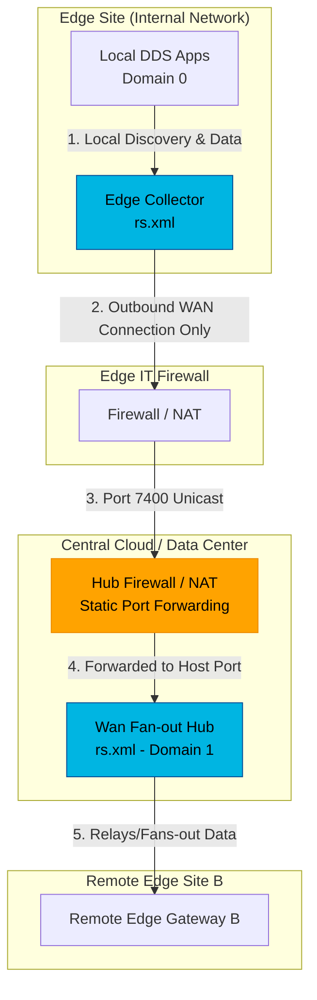

# Example 2: Routing Service

> **Port aggregation and WAN gateway patterns**

⏱️ **Time Required:** 20-30 minutes  
📊 **Difficulty:** Intermediate  
🔗 **Prerequisites:** Example 1 (CDS Discovery)  
📍 **You are here:** Phase 2 of 4 → Enterprise Scaling

---

## 📋 TL;DR

**What you'll accomplish:** Configure Routing Service to aggregate multiple local DDS participants onto a single WAN port, reducing firewall complexity.

**Key takeaway:** Routing Service acts as a "funnel"—collecting many local data streams and sending them through one managed port to remote sites.

---

## What You'll Learn

By the end of this example, you'll understand:
- ✅ Port aggregation for IT firewall compliance
- ✅ Edge collector and central hub deployment patterns
- ✅ Domain bridging with auto-topic routing
- ✅ RT/WAN transport for WAN connectivity

---

## The Challenge

Standard DDS assigns unique ports to every application (DomainParticipant), which can quickly consume hundreds of ports—something IT departments strictly forbid.
* **The Problem:** IT may only grant you a single open port (e.g., port 7400) to communicate between wards or floors.
* **The Appliance Solution:** The **Routing Service** acts as a "fanout node" or aggregator. It collects all DDS traffic from the local subnet and tunnels it through a single, predetermined port to the remote destination. 
* **Transformative Impact:** You can scale to dozens of devices locally while appearing as only **one connection** to the IT firewall, drastically reducing the "surface area" you need to negotiate with IT.



This example is a workable pattern for RTI Connext Professional Routing Service using Real-Time WAN Transport (UDPv4_WAN):

 - Edge/Gateway config: collects DDS traffic from the local LAN/domain and forwards it through one predetermined WAN UDP port to a remote relay.
 - Hub/Relay config: receives WAN traffic on that single public port and fans it out to all connected remote devices.

This follows the documented Routing Service WAN-gateway pattern and the relayed edge-to-edge deployment pattern, and uses the documented single-port comm_ports mapping for UDPv4_WAN. It also uses auto_topic_route with * filters to propagate all discovered topics/types. RTI’s documentation show this exact architectural split: a LAN-side participant plus a WAN-side participant on the edge, and a WAN-only participant on the relay/fan-out side.

### Edge / local-subnet collector configuration



[EdgeCollector/rs.xml](EdgeCollector/rs.xml)

Use this on each site that should gather local DDS traffic and tunnel it to the remote hub.

Replace:

 - LOCAL_DOMAIN_ID with your LAN DDS domain
 - REMOTE_HUB_PUBLIC_IP with the public IP/DNS of the remote hub
 - EDGE_WAN_HOST_PORT with the local UDP port bound on this gateway
 - REMOTE_HUB_PUBLIC_PORT with the hub’s public UDP port


### Remote hub / fan-out configuration

[WanFanoutHub/rs.xml](WanFanoutHub/rs.xml)

Use this on the central public node. It acts as a WAN relay/fan-out for all connected edge gateways.

Replace:

 - HUB_PUBLIC_IP with the public IP/DNS of the relay host
 - HUB_HOST_PORT with the local UDP port on the relay host
 - HUB_PUBLIC_PORT with the externally reachable forwarded/public UDP port

If the host is directly public, host and public can be the same.

### Important deployment notes



#### 1. Single predetermined port
 - On the edge/internal participant, a single receive port is configured with:
```xml
<comm_ports>
    <default>
        <host>7400</host>
    </default>
</comm_ports>
```
 - On the public relay/external participant, use:
```xml
<comm_ports>
    <default>
        <host>7400</host>
        <public>7400</public>
    </default>
</comm_ports>
```
This is the documented single-port UDPv4_WAN setup.

#### 2. NAT/firewall
 - The hub must be reachable on its public UDP port.
 - If the hub is behind NAT, configure static port forwarding from public UDP port to the host UDP port.
 - The edge gateways only need outbound reachability to the hub.

#### 3. Domain IDs
I used:
 - domain_id 0 for LAN side
 - domain_id 1 for WAN side
That separation is a common Routing Service WAN-gateway pattern. Keep the WAN-side domain consistent across all edge gateways and the hub.

#### 4. Caveats
  - This configuration routes all discovered topics/types through Routing Service.
  - It does not magically capture traffic from applications that cannot discover the local gateway.
  - In practice, local applications must be on the same DDS domain and able to discover the gateway Routing Service participant.

---

## 📚 Key Takeaways

- ✅ Routing Service aggregates multiple participants onto a single WAN port
- ✅ Edge collectors bridge local LAN domains to WAN domains
- ✅ Central hubs fan out WAN traffic to multiple remote sites
- ✅ Auto-topic routing (`*`) automatically propagates all discovered topics
- ✅ RT/WAN transport enables single-port communication across WANs

---

## What's Next?

**→ Continue to [Example 3: Real-Time WAN Transport](../3.%20Real-Time%20Wan%20Transport/README.md)**

Learn how to enable peer-to-peer connectivity through NAT and firewalls using RT/WAN transport and UDP hole punching.

[← Back to Examples](../README.md) | **Connext Router Appliance Examples**