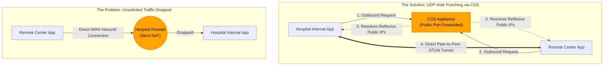
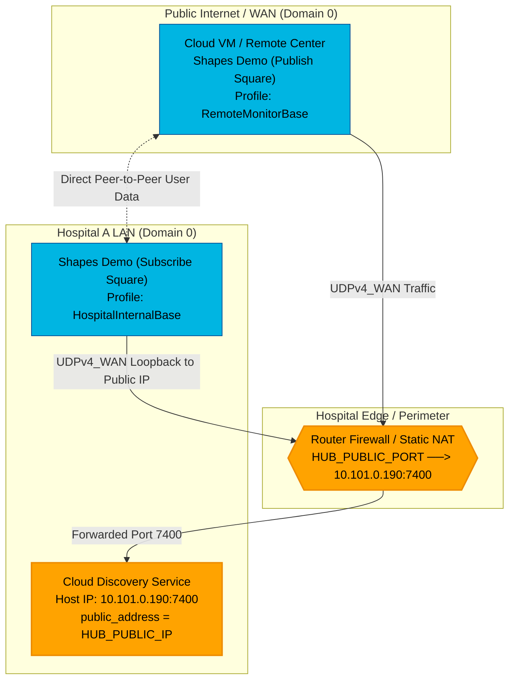
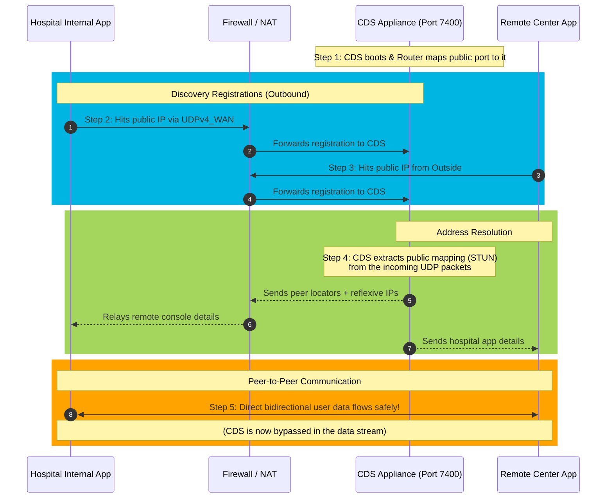

# Example 3: Real-Time WAN Transport

> **NAT traversal and peer-to-peer connectivity through firewalls**

⏱️ **Time Required:** 20-30 minutes  
📊 **Difficulty:** Intermediate  
🔗 **Prerequisites:** Examples 1 & 2  
📍 **You are here:** Phase 3 of 4 → Global Connectivity

---

## 📋 TL;DR

**What you'll accomplish:** Enable peer-to-peer DDS communication through NAT and firewalls using RT/WAN transport and CDS-assisted discovery.

**Key takeaway:** UDP hole punching allows bidirectional communication through firewalls without VPN overhead—perfect for remote monitoring and telemedicine.

---

## What You'll Learn

By the end of this example, you'll understand:
- ✅ NAT traversal using UDP hole punching
- ✅ CDS-assisted public address resolution
- ✅ Configuring RT/WAN transport
- ✅ Peer-to-peer data flow without relays

---

## The Challenge

Hospitals often use Network Address Translation (NAT) and strict firewalls that block incoming connections, preventing remote monitoring or telemedicine.
* **The Problem:** Even if you have the IP, the firewall will drop packets that it didn't specifically "ask for."
* **The Appliance Solution:** The **RT/WAN transport** uses UDP hole punching. It allows the appliance to establish a peer-to-peer connection through the firewall by "punching" a path out that the remote side can then use to talk back.
* **Transformative Impact:** It provides **VPN-like connectivity without the overhead or latency of a VPN**, allowing real-time data to flow across different network segments securely and reliably.



This example shows Real-Time WAN Transport (UDPv4_WAN), Cloud Discovery Service (CDS), and Shapes Demo to demonstrate a hospital-hosted deployment where:

 - CDS runs inside Hospital A
 - one Shapes Demo instance also runs inside Hospital A
 - a remote console / teleoperator runs outside the hospital at a remote center

### Scenario

A hospital wants to allow a remote telesurgery console to access hospital systems from outside the network without requiring a VPN in the data path.

### The problem

Hospital networks often use:

 - NAT
 - strict firewalls
 - blocked unsolicited inbound traffic

This prevents a remote console from directly reaching internal DDS participants unless the network is configured carefully.

### The solution

Use:

 - Real-Time WAN Transport
 - Cloud Discovery Service
 - a static NAT mapping for CDS at Hospital A

This allows:

 - The remote consol to contact CDS at a known public address
 - CDS to assist discovery and public-address resolution
 - The hospital participant and remote participant to communicate peer-to-peer over WAN transport

### Topology


### Interaction model

 - Hospital A Shapes instance is an internal participant
 - CDS is also inside Hospital A, but exposed publicly through static NAT
 - Remote console is the external participant
 - Both participants use Real-Time WAN Transport (UDPv4_WAN)
 - Both participants use the public CDS address as their initial peer
 - CDS helps discovery and public-address resolution
 - After discovery, communication is peer-to-peer over WAN transport, not through CDS for user data

That peer-to-peer behavior after CDS-assisted discovery is described in the RT/WAN NAT traversal documentation.

### Important Note
Both participants point to the public CDS address:

`<element>rtps@udpv4_wan://HUB_PUBLIC_IP:HUB_PUBLIC_PORT</element>`

Even the internal hospital participant can use the public CDS address in this WAN-oriented demo model. RTI’s WAN documentation describes CDS as being identified by its publicly reachable address for WAN participants.

As shown in the Topology Diagram, the Hospital Internal App sends its data up to the public edge firewall before looping back down to the CDS. If your firewall does not support Hairpin NAT, this internal client won't reach the target and a different approach will be needed.
For this simple demo, the assumption is that Hospital A can reach the CDS public address.

### How discovery works in this topology



#### Step 1: CDS starts inside Hospital A

CDS listens on:
 - private host: 192.168.1.1
 - UDP port: 7400

Hospital A firewall/NAT exposes it publicly as:
- HUB_PUBLIC_IP:HUB_PUBLIC_PORT

#### Step 2: Hospital A Shapes Demo starts

The internal participant:

 - uses UDPv4_WAN
 - sends discovery traffic to: `rtps@udpv4_wan://HUB_PUBLIC_IP:HUB_PUBLIC_PORT`

#### Step 3: Remote console starts

The external participant:

 - also uses UDPv4_WAN
 - also sends discovery traffic to: `rtps@udpv4_wan://HUB_PUBLIC_IP:HUB_PUBLIC_PORT`

#### Step 4: CDS resolves reachable addresses

CDS inspects the received WAN discovery traffic and extends participant announcements with service-reflexive/public address information so the peers can learn how to reach each other.

#### Step 5: Peer-to-peer communication begins

After discovery and address resolution:

 - Hospital A Shapes Demo and the remote console communicate directly over WAN transport
 - CDS is not the steady-state user-data relay

That direct communication step is explicitly described in the CDS NAT traversal documentation.


### Firewall Configuration Required

On your router/firewall at the hospital perimeter:

1. **Static NAT Rule**:
   - External: `YOUR_PUBLIC_IP:7400` (UDP)
   - Internal: `192.168.1.1:7400` (CDS appliance)

2. **Firewall Rule**:
   - Allow UDP inbound to port 7400 from ANY
   - Allow UDP outbound from 192.168.1.1:7400 to ANY

3. **Verify Public IP**:
```bash
curl ifconfig.me
# Use this IP as HUB_PUBLIC_IP in configurations   
```

### Running the demo

#### Start CDS inside Hospital A

On the CDS host:

rticlouddiscoveryservice -cfgFile cds.xml -cfgName HospitalCDS

#### Start Shapes Demo inside Hospital A

 - Configure a UDP port-forward rule on your internet router so WAN HUB_PUBLIC_IP:HUB_PUBLIC_PORT forwards to LAN 192.168.1.1:7400 (the CDS host).
 - Place USER_RTI_SHAPES_DEMO_QOS_PROFILES.xml in the Shapes Demo workspace

 - Start Shapes Demo
 - Use Domain 0
 - Open Controls / Configuration
 - Press Stop
 - Select profile HospitalInternalBase
 - Press Start
 - Subscribe to Square

#### Start Shapes Demo at the remote center

 - Place the same QoS file in the Shapes Demo workspace
 - Edit the QoS file to set the HUB_PUBLIC_IP and HUB_PUBLIC_PORT
 - Start Shapes Demo
 - Use Domain 0
 - Open Controls / Configuration
 - Press Stop
 - Select profile RemoteMonitorBase
 - Press Start
 - Publish a Square shape

---

## 📚 Key Takeaways

- ✅ RT/WAN transport enables NAT traversal without VPNs
- ✅ CDS assists with public address resolution (STUN-like behavior)
- ✅ UDP hole punching allows bidirectional peer-to-peer communication
- ✅ After discovery, data flows directly between participants (not through CDS)
- ✅ Static NAT port forwarding required only for CDS, not for each participant

---

## What's Next?

**→ Continue to [Example 4: Security](../4.%20Security/README.md)**

Learn how to add authentication, encryption, and fine-grained access control to secure your WAN-connected DDS applications. 

[← Back to Examples](../README.md) | **Connext Router Appliance Examples**