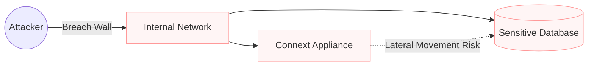
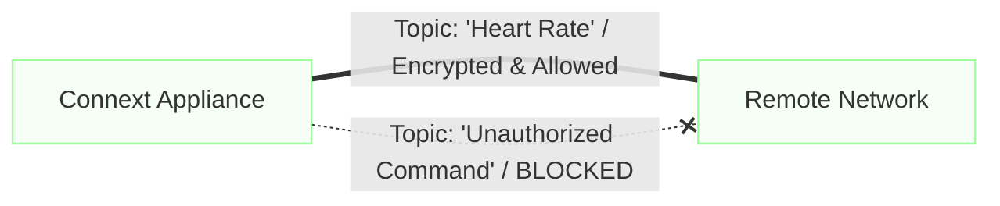
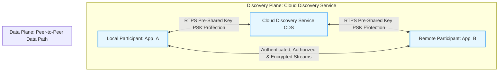
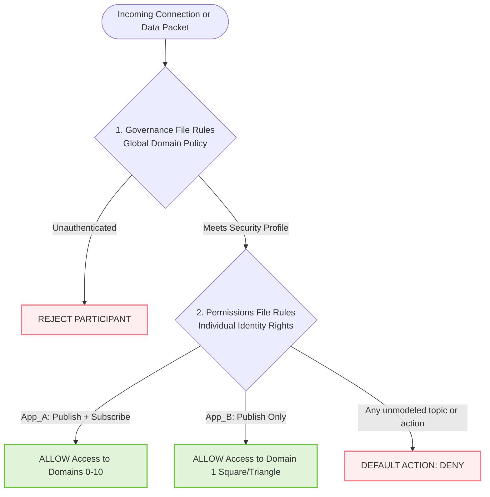
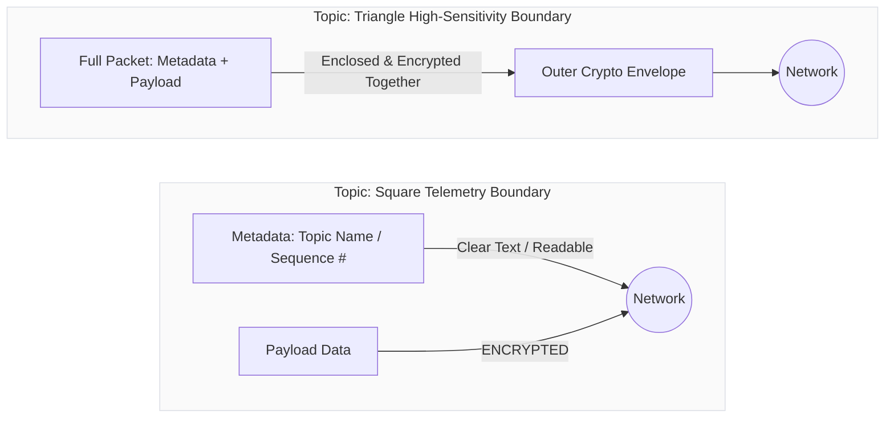
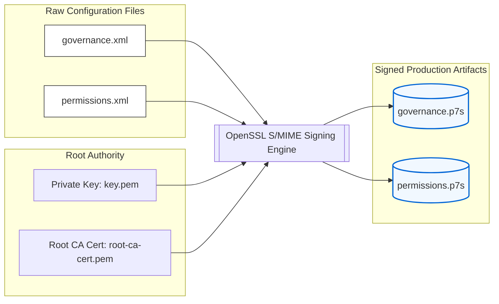

## Security Without Compromise (Connext Secure)
IT departments are often hesitant to allow data bridging because of "lateral movement" risks (the fear that a breach in one device leads to the whole network).
* **The Problem:** Standard network security (like a VPN) is "all or nothing"—once you're in, you can see everything.



* **The Appliance Solution:** **Connext Secure** provides fine-grained, data-centric security. It encrypts and authenticates individual "Topics" (specific data streams).


* **Transformative Impact:** Even though your appliance is bridging the network, it enforces a **Zero-Trust** model. You can prove to IT that the appliance *only* forwards "Heart Rate" data and strictly blocks any unauthorized commands, satisfying even the most rigid cybersecurity audits.

Example 3 focused on WAN reachability (RT/WAN transport + CDS-assisted discovery through NAT/firewall).
Example 4 keeps that same connectivity model and adds authentication, authorization, signing, and encryption across all participants.


### What Example 4 adds over Example 3



- Example 3: participants can discover each other over WAN using CDS and then communicate peer-to-peer.
- Example 4: all participants use security plugins and signed security artifacts so connectivity is not only reachable, but trusted and policy-controlled.
- Security also covers participant discovery via CDS: CDS-relayed discovery traffic is protected with RTPS PSK settings, not left in plaintext.

### Security Model in this example

- Local participant and remote participant use DDS Security identity/auth/access-control artifacts:
        - identity CA/certificate/private key
        - signed governance file
        - signed permissions file
- CDS discovery path is also protected with RTPS PSK properties:
        - same passphrase on CDS and participants
        - same algorithm on CDS and participants
        - same protection kind on CDS and participants

This means both endpoint communication and participant discovery are protected.

### Governance and permissions: how policy is defined

The governance file defines domain-level and topic-level protection requirements. In this example:

- Unauthenticated participants are rejected.
- Join access control is enabled.
- RTPS protection is applied.
- RTPS PSK protection is enabled for CDS-assisted discovery/WAN binding traffic.
- Topic rules specify what is encrypted and what is access-controlled.

Permissions files define who is allowed to do what:

- `Local_Participant` (App_A): publish + subscribe on domains 0-10.
- `Remote_Participant` (App_B): publish only on domain 1, and only to Square/Triangle.
- Default action is DENY.



### Topic policy differences (threat-model illustration)

This demo uses two topics with different protections to show how threat modeling changes policy:

- `Square`:
        - payload data is encrypted
        - metadata is not encrypted
        - useful for lower-sensitivity telemetry where confidentiality is needed but metadata exposure is acceptable

- `Triangle`:
        - payload data is encrypted
        - metadata is also encrypted
        - useful for higher-sensitivity data where topic-level metadata leakage is not acceptable

A wildcard fallback rule denies access and disables protection for any topic not explicitly modeled.



### Sign security artifacts

From the security certificates created when the router was first configured (see [top-level readme](../../router/README.md)):

- To sign the governance file
```bash
openssl smime \
        -sign \
        -in governance.xml \
        -out governance.p7s \
        -signer [enter path]/security/cert/root-ca-cert.pem \
        -inkey [enter path]/security/root-ca/private/key.pem
```

- To sign the permissions file:

```bash
openssl smime \
        -sign \
        -in permissions.xml \
        -out permissions.p7s \
        -signer [enter path]/security/cert/root-ca-cert.pem \
        -inkey [enter path]/security/root-ca/private/key.pem
```


