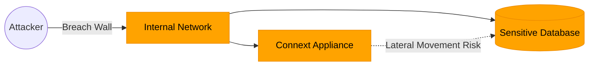
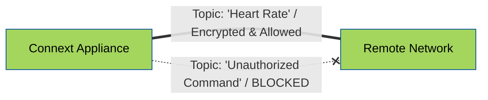
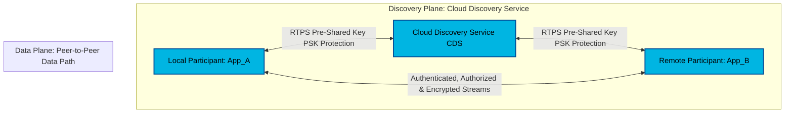
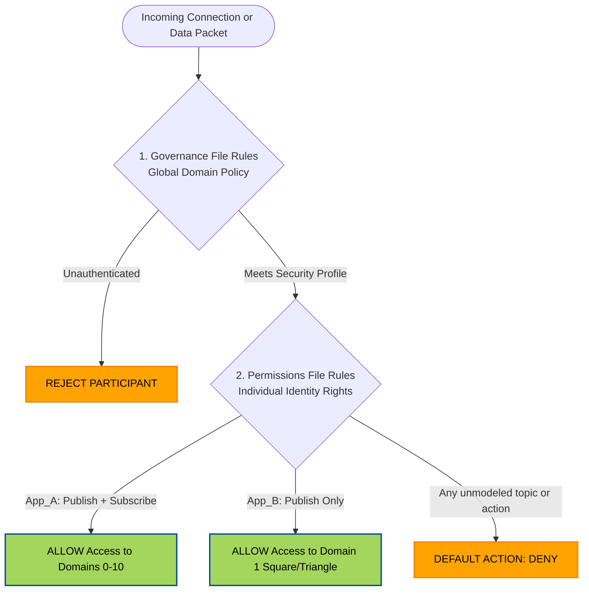
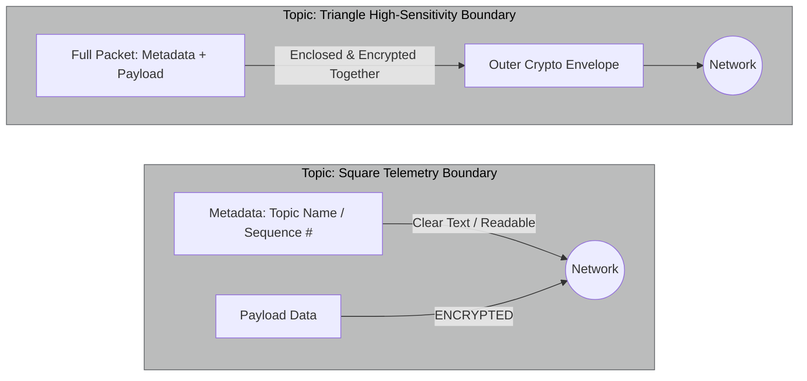
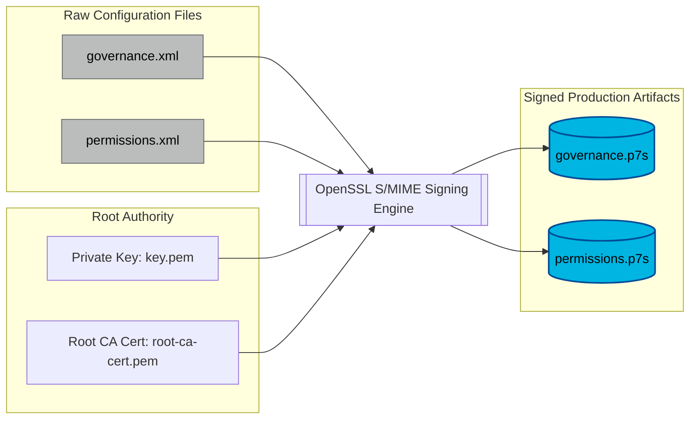

# Example 4: Security Without Compromise

> **Fine-grained authentication, authorization, and encryption**

⏱️ **Time Required:** 30-40 minutes  
📊 **Difficulty:** Advanced  
🔗 **Prerequisites:** Examples 1, 2 & 3  
📍 **You are here:** Phase 4 of 4 → Production Security

---

## 📋 TL;DR

**What you'll accomplish:** Add DDS Security to protect discovery and data with authentication, authorization, and encryption.

**Key takeaway:** Connext Secure provides fine-grained, data-centric security that enforces Zero-Trust policies at the topic level—proving to IT exactly what data is allowed to cross network boundaries.

---

## What You'll Learn

By the end of this example, you'll understand:
- ✅ Implementing DDS Security (identity, authentication, encryption)
- ✅ Creating and signing governance and permissions files
- ✅ Protecting CDS discovery with RTPS PSK
- ✅ Topic-level access control policies

---

## The Challenge

IT departments are often hesitant to allow data bridging because of "lateral movement" risks (the fear that a breach in one device leads to the whole network).
* **The Problem:** Standard network security (like a VPN) is "all or nothing"—once you're in, you can see everything.



* **The Appliance Solution:** **Connext Secure** provides fine-grained, data-centric security. It encrypts and authenticates individual "Topics" (specific data streams).


* **Transformative Impact:** Even though your appliance is bridging the network, it enforces a **Zero-Trust** model. You can prove to IT that the appliance *only* forwards "Heart Rate" data and strictly blocks any unauthorized commands, satisfying even the most rigid cybersecurity audits.

Example 3 focused on WAN reachability (RT/WAN transport + CDS-assisted discovery through NAT/firewall).
Example 4 keeps that same connectivity model and adds authentication, authorization, signing, and encryption across all participants.


### What Example 4 adds over Example 3



- Example 3: participants can discover each other over WAN using CDS and then communicate peer-to-peer.
- Example 4: all participants use security plugins and signed security artifacts so connectivity is not only reachable, but trusted and policy-controlled.
- Security also covers participant discovery via CDS: CDS-relayed discovery traffic is protected with RTPS PSK settings, not left in plaintext.

### Security Model in this example

- Local participant and remote participant use DDS Security identity/auth/access-control artifacts:
        - identity CA/certificate/private key
        - signed governance file
        - signed permissions file
- CDS discovery path is also protected with RTPS PSK properties:
        - same passphrase on CDS and participants
        - same algorithm on CDS and participants
        - same protection kind on CDS and participants

This means both endpoint communication and participant discovery are protected.

### Governance and permissions: how policy is defined

The governance file defines domain-level and topic-level protection requirements. In this example:

- Unauthenticated participants are rejected.
- Join access control is enabled.
- RTPS protection is applied.
- RTPS PSK protection is enabled for CDS-assisted discovery/WAN binding traffic.
- Topic rules specify what is encrypted and what is access-controlled.

Permissions files define who is allowed to do what:

- `Local_Participant` (App_A): publish + subscribe on domains 0-10.
- `Remote_Participant` (App_B): publish only on domain 1, and only to Square/Triangle.
- Default action is DENY.



### Topic policy differences (threat-model illustration)

This demo uses two topics with different protections to show how threat modeling changes policy:

- `Square`:
        - payload data is encrypted
        - metadata is not encrypted
        - useful for lower-sensitivity telemetry where confidentiality is needed but metadata exposure is acceptable

- `Triangle`:
        - payload data is encrypted
        - metadata is also encrypted
        - useful for higher-sensitivity data where topic-level metadata leakage is not acceptable

A wildcard fallback rule denies access and disables protection for any topic not explicitly modeled.



---

## Configuration Files Overview

**Files needed:**
- [ ] Governance file (`./governance.xml`) - Define security policies
- [ ] Permissions files (`Local/permissions.xml`, `Remote/permissions.xml`) - Define access rights
- [ ] CA certificates and private keys (`cert/root-ca-cert.pem`) - from router setup
- [ ] Local participant identity certificates (`cert/a-cert.pem`, cert/a-key.pem`) - from router setup
- [ ] Remote participant identity certificates (`cert/b-cert.pem`, cert/b-key.pem`) - from router setup
- [ ] CDS configuration with RTPS PSK (`Router/cds.xml`)
- [ ] Participant QoS profiles with security settings (`Local/USER_RTI_SHAPES_DEMO_QOS_PROFILES.xml`, Remote/USER_RTI_SHAPES_DEMO_QOS_PROFILES.xml`)

---

## Step-by-Step Configuration

### Step 1: Prepare Security Artifacts

**What you need to do:**
1. Sign the governance.xml file from the example folder with the CA certificate and key from the router setup
```bash
openssl smime \
        -sign \
        -in governance.xml \
        -out governance.p7s \
        -signer [enter path]/security/cert/root-ca-cert.pem \
        -inkey [enter path]/security/root-ca/private/key.pem
```
2. Copy the resulting governance.p7s file to the local and remote hosts
3. Sign the local and remote permissions.xml files (they are specific to each role) with the CA certificate and key from the router setup
```bash
openssl smime \
        -sign \
        -in permissions.xml \
        -out permissions.p7s \
        -signer [enter path]/security/cert/root-ca-cert.pem \
        -inkey [enter path]/security/root-ca/private/key.pem
```
4. Copy the resulting local and remote permissions.p7s files to the respective hosts 

**Expected files on the Local host:**
```
security/
├── governance.p7s             # Domain-wide security policies
├── permissions.p7s            # Local participant permissions
├── root-ca-cert.pem           # CA certificate
├── a-cert.pem                 # Local participant certificate
└── a-key.pem                  # Local participant key
```
**Expected files on the Remote host:**
```
security/
├── governance.p7s             # Domain-wide security policies
├── permissions.p7s            # Local participant permissions
├── root-ca-cert.pem           # CA certificate
├── b-cert.pem                 # Remote participant certificate
└── b-key.pem                  # Remote participant key
```




**Verify signed files:**
```bash
# Check that .p7s files were created
ls -l governance.p7s permissions_local.p7s permissions_remote.p7s

# Verify signature (optional)
openssl smime -verify -in governance.p7s -CAfile root-ca-cert.pem -noverify
```

---

### Step 2: Configure CDS artefacts


**What you need to do:**
1. Copy the CDS configuration file: `Router/cds.xml` to the router
2. Verify that the pre-shared key in `Router/cds.xml` is the same as the one defined in the Local and Remote hosts' QoS files 
(Ensure all participants use the same PSK passphrase)

---

### Step 3: Configure Local Participant (Hospital Internal)

**What you need to do:**
1. Copy the file: `Local/USER_QOS_PROFILES.xml` to the Local host
2. Review the security plugin properties and check that the referenced files are present
3. Ensure RTPS PSK matches CDS and remote participant
---

### Step 4: Configure Remote Participant

**What you need to do:**
1. Copy the file: `Remote/USER_QOS_PROFILES.xml` to the Local host
2. Review the security plugin properties and check that the referenced files are present
3. Ensure RTPS PSK matches CDS and local participant


---

## ✅ Testing & Verification

### What Success Looks Like

After completing this example, you should observe:
1. **Secure CDS Discovery** - Participants discover through CDS with PSK-protected traffic
2. **Authenticated Connections** - Only participants with valid certificates can join
3. **Encrypted Data** - User data is encrypted based on governance rules
4. **Access Control Enforced** - Permissions are respected (local can pub/sub, remote can only pub)

### Testing Steps

**Step-by-step testing:**

1. **Start Secure CDS on the appliance:**
   ```bash
   rticlouddiscoveryserviceapp -cfgFile cds.xml -cfgName HospitalSecureCDS
   ```

2. **Launch local secure participant:**
   ```bash
   rtishapesdemo -configure
   ```
 - Stop the particiapant
 - Disable the Distributed Logger and the Monitoring Library 2.0
 - Click "Manage QoS"
 - Add the Local/USER_QOS_PROFILES.xml file 
 - Click OK to close the dialog and save the included QoS file list
 - Choose the profile: "HospitalSecureWanDemoLib::HospitalInternalBase" from the dropdown of configured QoS profiles
 - Select a domain ID (this must be the same as the remote participant)
 - Click Start

3. **Launch remote secure participant:**
   ```bash
   rtishapesdemo -configure
   ```
 - Stop the particiapant
 - Disable the Distributed Logger and the Monitoring Library 2.0
 - Click "Manage QoS"
 - Add the Remote/USER_QOS_PROFILES.xml file 
 - Click OK to close the dialog and save the included QoS file list
 - Choose the profile: "HospitalSecureWanDemoLib::RemoteMonitorBase" from the dropdown of configured QoS profiles
 - Select a domain ID (this must be the same as the local participant)
 - Click Start

4. **Verify authentication:**
   - Check that both participants discover each other
   - Verify encrypted traffic in logs
   - Confirm permissions are enforced

---

## 🔧 Troubleshooting

| Problem | Possible Cause | Solution |
|---------|---------------|----------|
| Participants don't discover | PSK mismatch | Verify all participants and CDS use same passphrase |
| Authentication failure | Wrong certificates | Check certificate paths and validity |
| Permission denied | Permissions mismatch | Verify permissions file covers the topic/domain |
| Security plugin not loaded | Missing plugin | Ensure security plugin libraries are accessible |

### Common Mistakes

- ❌ Forgetting to sign governance/permissions files
- ❌ Certificate paths pointing to wrong locations
- ❌ PSK passphrase mismatch between CDS and participants
- ❌ Using unsigned `.xml` files instead of signed `.p7s` files
- ❌ Clock skew issues (certificates have time validity)

---

## �📚 Key Takeaways

- ✅ DDS Security provides fine-grained, data-centric access control
- ✅ Governance files define domain-wide security policies (encryption, authentication)
- ✅ Permissions files specify what each identity can publish/subscribe
- ✅ RTPS PSK protects CDS discovery traffic
- ✅ Security artifacts must be signed by a trusted Certificate Authority
- ✅ Zero-Trust model: default action is DENY unless explicitly allowed

---

## What's Next?

**🎉 Congratulations!** You've completed all four examples and built a production-ready Connext router appliance.

### You Now Have
- ✅ Zero-multicast discovery (CDS)
- ✅ Port-efficient WAN connectivity (Routing Service)
- ✅ NAT traversal without VPNs (RT/WAN Transport)
- ✅ Fine-grained security and encryption (Connext Secure)

### Ready for Deployment?

Consider these production steps:
1. **Performance Tuning** - Optimize QoS settings for your specific use case
2. **Monitoring & Logging** - Set up alerting for your appliance services
3. **High Availability** - Deploy redundant appliances for failover
4. **Documentation** - Document your network topology and security policies
5. **Testing** - Perform load testing and failover scenarios

### Additional Resources
- [RTI Community Portal](https://community.rti.com) - Forums and documentation
- [Connext Professional Documentation](https://community.rti.com/documentation/latest)
- [RTI Security Documentation](https://community.rti.com/static/documentation/connext-dds/current/doc/manuals/connext_dds_secure/users_manual/index.html)
- [RTI Academy](https://academy.rti.com) - Training courses

[← Back to Examples](../README.md) | **Connext Router Appliance Examples**