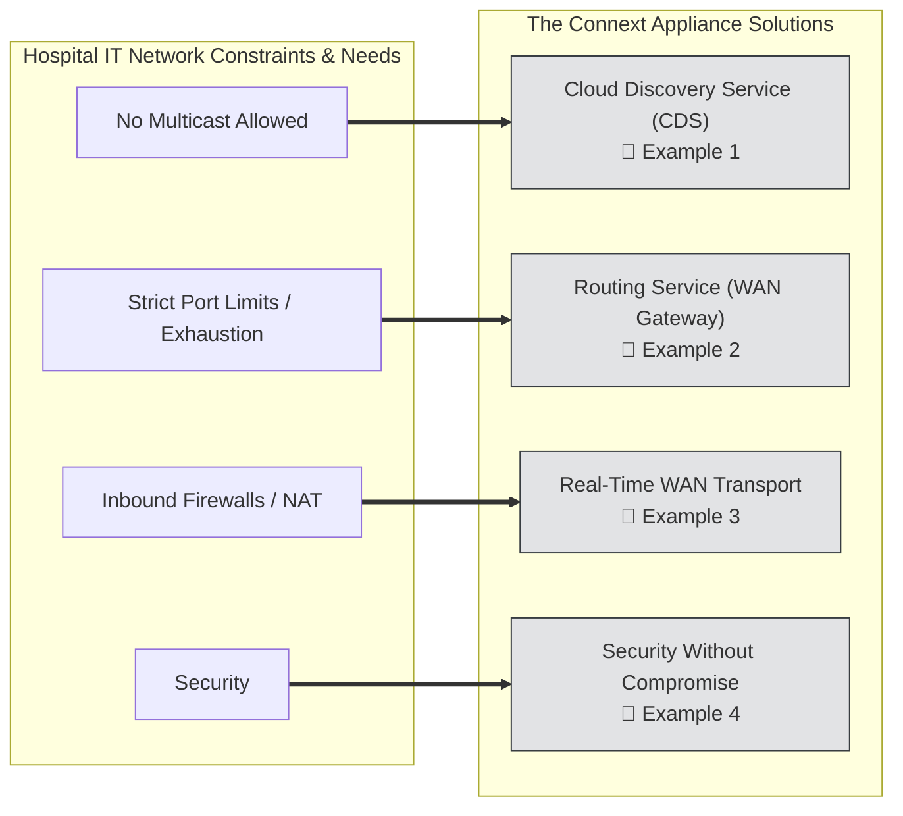
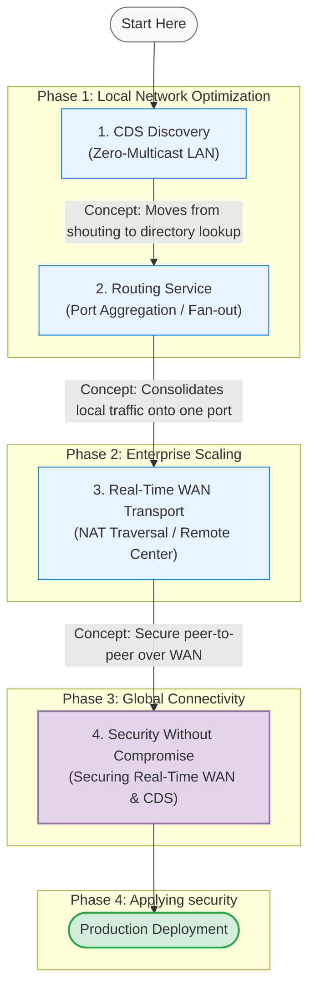

## Examples  
Once the router has been configured, with all the software installed, we can now get to testing out the functionality and work though some specific examples of what can be acheived.

Building a **Connext router appliance** on a device like the BananaPi BPI-R3 allows us to create a bespoke, hardware-isolated "connectivity gateway" that addresses the major IT constraints identified in the RTI blog post: **multicast prohibition**, **port exhaustion**, **navigating complex firewalls** and **security rigidity**. 

In a hospital environment—where IT departments treat medical devices as "black boxes" and apply restrictive network policies—this appliance acts as a transformative "bridge" that allows complex distributed systems to function without requiring the IT staff to reconfigure the entire hospital network.

### 1. Breaking the Multicast Barrier (Cloud Discovery Service)
Traditional DDS discovery relies on UDP Multicast (the "shout-and-listen" method). However, hospital IT often disables multicast to prevent network congestion.
* **The Problem:** Without multicast, applications can’t "see" each other to start communicating.
* **The Appliance Solution:** By hosting the **Cloud Discovery Service (CDS)**, your appliance acts as a "rendezvous point." Instead of shouting to the whole network, applications simply check in with the appliance (via unicast) to find their peers.
* **Transformative Impact:** It enables dynamic discovery in a "Zero-Multicast" environment without requiring you to manually hardcode every IP address in the system.

[Click to open](1.%20CDS%20Discovery/README.md)

### 2. Solving Port Exhaustion (Routing Service)
Standard DDS assigns unique ports to every application (DomainParticipant), which can quickly consume hundreds of ports—something IT departments strictly forbid.
* **The Problem:** IT may only grant you a single open port (e.g., port 7400) to communicate between wards or floors.
* **The Appliance Solution:** The **Routing Service** acts as a "fanout node" or aggregator. It collects all DDS traffic from the local subnet and tunnels it through a single, predetermined port to the remote destination. 
* **Transformative Impact:** You can scale to dozens of devices locally while appearing as only **one connection** to the IT firewall, drastically reducing the "surface area" you need to negotiate with IT.

[Click to open](2.%20Routing%20Service/README.md)

### 3. Navigating Complex Firewalls (Real-Time WAN Transport)
Hospitals often use Network Address Translation (NAT) and strict firewalls that block incoming connections, preventing remote monitoring or telemedicine.
* **The Problem:** Even if you have the IP, the firewall will drop packets that it didn't specifically "ask for."
* **The Appliance Solution:** The **RT/WAN transport** uses UDP hole punching. It allows the appliance to establish a peer-to-peer connection through the firewall by "punching" a path out that the remote side can then use to talk back.
* **Transformative Impact:** It provides **VPN-like connectivity without the overhead or latency of a VPN**, allowing real-time data to flow across different network segments securely and reliably.

[Click to open](3.%20Real-Time%20Wan%20Transport/README.md)

### 4. Security Without Compromise (Connext Secure)
IT departments are often hesitant to allow data bridging because of "lateral movement" risks (the fear that a breach in one device leads to the whole network).
* **The Problem:** Standard network security (like a VPN) is "all or nothing"—once you're in, you can see everything.
* **The Appliance Solution:** **Connext Secure** provides fine-grained, data-centric security. It encrypts and authenticates individual "Topics" (specific data streams).
* **Transformative Impact:** Even though your appliance is bridging the network, it enforces a **Zero-Trust** model. You can prove to IT that the appliance *only* forwards "Heart Rate" data and strictly blocks any unauthorized commands, satisfying even the most rigid cybersecurity audits.

[Click to open](4.%20Security/README.md)

