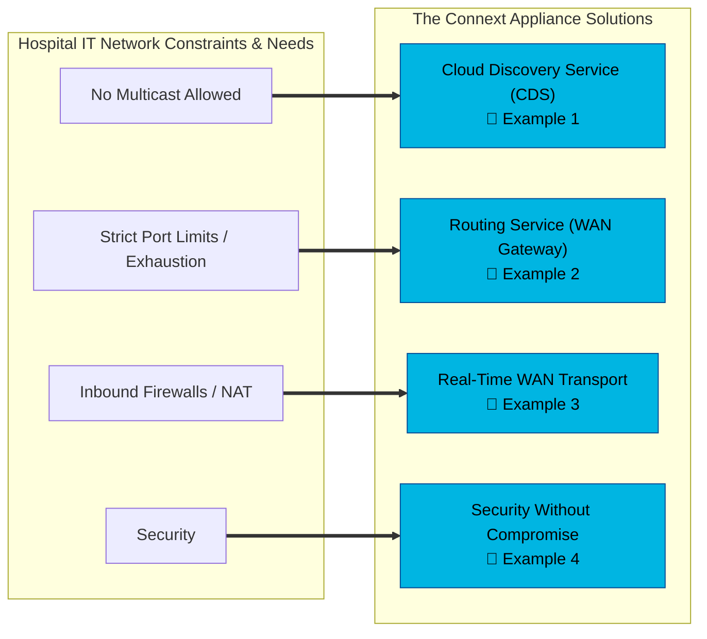
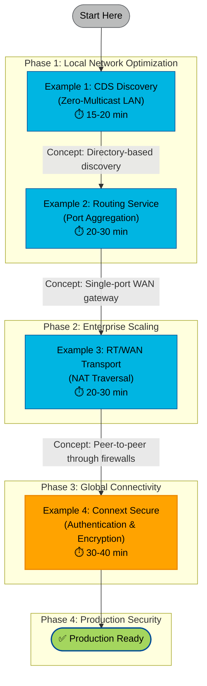

# Connext Router Appliance Examples

> **Hands-on demonstrations of each appliance capability**

## Overview

Once your router appliance has been configured with all software installed, these examples provide hands-on demonstrations of the four core capabilities that break through IT network constraints.

Each example builds progressively on concepts from previous examples, demonstrating real-world deployment patterns for RTI Connext in restricted network environments.

## Before You Begin

### Prerequisites

**Required Knowledge:**
- ✅ Basic understanding of DDS pub-sub concepts
- ✅ Familiarity with RTI Connext DomainParticipants
- ✅ Basic XML configuration experience

**Required Hardware/Software:**
- ✅ Configured BananaPi BPI-R3 appliance (see [Router Build Guide](../router/README.md))
- ✅ RTI Connext Professional 7.3.1 or later
- ✅ RTI Shapes Demo (for testing examples 3 & 4)
- ✅ Network access to the appliance (192.168.1.1)

**Recommended Tools:**
- `rtiddsspy` - Monitor DDS traffic
- `rtiddsping` - Verify connectivity
- Network packet analyzer (Wireshark) - Optional, for deep debugging

### How to Use These Examples

> **💡 Important:** These examples are designed as a **progressive learning path**. Each example assumes you understand concepts from previous examples.

**Recommended Order:**
1. Start with Example 1 (CDS Discovery)
2. Continue sequentially through Examples 2-4
3. Each example takes 15-40 minutes to complete

**Can I skip ahead?** 
- Example 1 → Can be done standalone
- Example 2 → Requires understanding Example 1 concepts  
- Example 3 → Builds on Examples 1 & 2
- Example 4 → Adds security to Example 3 (requires all previous knowledge)

---

## The Four-Phase Learning Path 

In a hospital environment—where IT departments treat medical devices as "black boxes" and apply restrictive network policies—this appliance acts as a transformative "bridge" that allows complex distributed systems to function without requiring the IT staff to reconfigure the entire hospital network.

### Your Learning Journey

---

## What You'll Build

By completing all examples, you'll have:
- ✅ A zero-multicast discovery infrastructure
- ✅ Port-efficient WAN connectivity (1 port instead of 100+)
- ✅ NAT-traversing peer-to-peer data paths
- ✅ Fine-grained security with topic-level access control
- ✅ Production-ready configuration templates

---

## Example 1: Cloud Discovery Service

⏱️ **Time:** 15-20 minutes | 📊 **Difficulty:** Beginner | 🔗 **Requires:** None

### What You'll Learn
- How DDS discovery works without multicast
- Configuring participants to use Cloud Discovery Service
- Understanding unicast-only discovery patterns

### The Challenge
Traditional DDS discovery relies on UDP Multicast (the "shout-and-listen" method). However, hospital IT often disables multicast to prevent network congestion—meaning applications can't "see" each other to start communicating.

### The Solution
By hosting **Cloud Discovery Service (CDS)** on your appliance, it acts as a "rendezvous point." Instead of shouting to the whole network, applications check in with the appliance (via unicast) to find their peers—enabling dynamic discovery in a "Zero-Multicast" environment.

**[→ Start Example 1](1.%20CDS%20Discovery/README.md)**

---

## Example 2: Routing Service

⏱️ **Time:** 20-30 minutes | 📊 **Difficulty:** Intermediate | 🔗 **Requires:** Example 1

### What You'll Learn
- Port aggregation for WAN connectivity
- Configuring edge collectors and central hubs
- Understanding domain bridging patterns

### The Challenge
Standard DDS assigns unique ports to every application (DomainParticipant), quickly consuming hundreds of ports—something IT departments strictly forbid. IT may only grant you a single open port (e.g., 7400) to communicate between network segments.

### The Solution
**Routing Service** acts as a "fanout node" or aggregator. It collects all DDS traffic from the local subnet and tunnels it through a single, predetermined port to the remote destination—letting you scale to dozens of devices while appearing as only one connection to IT firewalls.

**[→ Start Example 2](2.%20Routing%20Service/README.md)**

---

## Example 3: Real-Time WAN Transport

⏱️ **Time:** 20-30 minutes | 📊 **Difficulty:** Intermediate | 🔗 **Requires:** Examples 1 & 2

### What You'll Learn
- NAT traversal using UDP hole punching
- Configuring RT/WAN transport
- CDS-assisted public address resolution

### The Challenge
Hospitals use Network Address Translation (NAT) and strict firewalls that block incoming connections, preventing remote monitoring or telemedicine. Even if you have the IP, the firewall drops packets it didn't specifically "ask for."

### The Solution
**RT/WAN transport** uses UDP hole punching to establish peer-to-peer connections through firewalls. The appliance "punches" a path out that the remote side can use to talk back—providing VPN-like connectivity without the overhead or latency of a VPN.

**[→ Start Example 3](3.%20Real-Time%20Wan%20Transport/README.md)**

---

## Example 4: Security Without Compromise

⏱️ **Time:** 30-40 minutes | 📊 **Difficulty:** Advanced | 🔗 **Requires:** Examples 1, 2 & 3

### What You'll Learn
- Implementing DDS Security (authentication & encryption)
- Configuring governance and permissions files
- Protecting CDS discovery with RTPS PSK

### The Challenge  
IT departments are hesitant to allow data bridging due to "lateral movement" risks—the fear that a breach in one device leads to the whole network. Standard network security (like VPNs) is "all or nothing": once you're in, you can see everything.

### The Solution
**Connext Secure** provides fine-grained, data-centric security. It encrypts and authenticates individual "Topics" (specific data streams), enforcing a Zero-Trust model. You can prove to IT that the appliance only forwards authorized data (e.g., "Heart Rate") and strictly blocks unauthorized commands.

**[→ Start Example 4](4.%20Security/README.md)**

---

## What's Next?

After completing these examples, you'll have hands-on experience with:
- ✅ Zero-multicast discovery in restricted networks
- ✅ Port-efficient WAN connectivity
- ✅ NAT traversal without VPNs
- ✅ Fine-grained security and access control

### Ready for Production?

Consider these next steps:
1. **Performance Tuning** - Optimize QoS settings for your use case
2. **Monitoring** - Set up logging and alerting for your appliance
3. **High Availability** - Deploy redundant appliances for failover
4. **Documentation** - Document your specific network topology and configurations

### Additional Resources
- [RTI Community Portal](https://community.rti.com) - Forums and documentation
- [Connext Professional Documentation](https://community.rti.com/documentation/latest)
- [RTI Security Documentation](https://community.rti.com/static/documentation/connext-dds/current/doc/manuals/connext_dds_secure/users_manual/index.html)
- [RTI Academy](https://academy.rti.com) - Training courses

