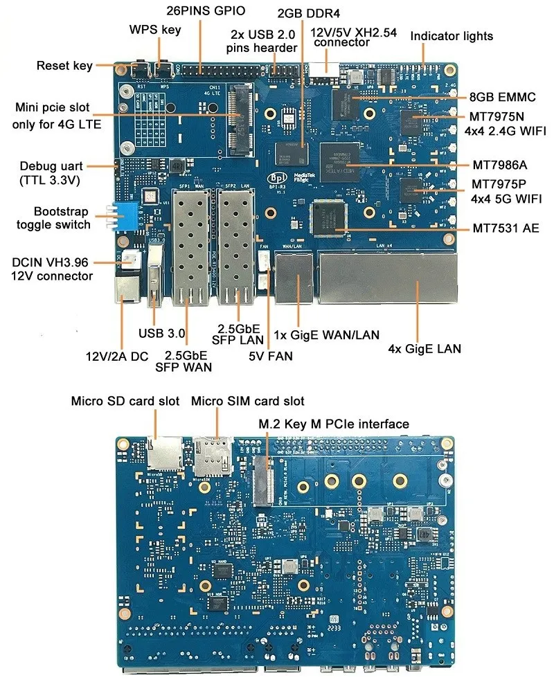

# User Guide: Building a Connext Appliance on BananaPi BPI-R3

This guide provides a step-by-step workflow to transform a [BananaPi BPI-R3](https://docs.banana-pi.org/en/BPI-R3/BananaPi_BPI-R3) into a dedicated RTI Connext Appliance. This setup includes a unified network bridge for wired and wireless interfaces, Webmin for management, and the deployment of RTI Connext professional tools.

---

## Table of Contents
1. [Prerequisites](#1-prerequisites)
2. [Stage 1: Image Selection and Flashing](#stage-1-image-selection-and-flashing)
3. [Stage 2: Initial System Configuration](#stage-2-initial-system-configuration)
4. [Stage 3: Unified Networking (Wired & Wireless Bridge)](#stage-3-unified-networking)
5. [Stage 4: Webmin Installation and Service Setup](#stage-4-webmin-installation)
6. [Stage 5: RTI Connext Component Deployment](#stage-5-rti-connext-deployment)
7. [Stage 6: Verification and Testing](#stage-6-verification-and-testing)
8. [Maintenance Notes](#maintenance-notes)

---

## 1. Prerequisites
- **Hardware:** [BananaPi BPI-R3](https://docs.banana-pi.org/en/BPI-R3/BananaPi_BPI-R3), MicroSD card (16GB+), 12V/2A DC Power Supply.
- **RTI Assets:** Binaries for `armv8Linux4.19gcc8.3.0` (or matching your kernel version) for:
    - RTI Routing Service
    - RTI Cloud Discovery Service
    - RTI Real-Time WAN Protocol libraries
    - RTI Security Plugins
    - RTI DDS Spy / Ping
- **Software:** Etcher or `dd` for flashing, SSH client (PuTTY or Terminal).

Banana Pi BPI-R3 Router board with MediaTek MT7986(Filogic 830) quad core ARM A53 + MT7531A chip design ,2G DDR RAM ,8G eMMC flash onboard,It is a very high performance open source router development board,support Wi-Fi 6/6E 2.4G wifi use MT7975N and 5G wifi use MT7975P, support 2 SFP 2.5GbE port, and 5 GbE network port.



The MT7986(Filogic 830) integrates four Arm Cortex-A53 cores up to 2GHz with up to 18,000 DMIPs of processing power and 6Gbps of dual 4x4 Wi-Fi 6/6E connectivity. It has two 2.5g Ethernet interfaces and serial peripheral interfaces (SPI). Filogic 830‘s built-in hardware acceleration engine enables fast and reliable Wi-Fi offloading and wireless network connection. In addition, the chip supports Mediatek FastPath™ technology, which is suitable for games, AR/VR and other low-latency applications. Wi-fi 6E has many advantages over its predecessors, including lower latency, larger bandwidth capacity and faster transmission rates. Wireless network devices supporting the 6GHz band mainly use 160MHz wide channel and 6GHz uncongested bandwidth to provide multigigabit transmission and low-latency wi-fi connection, providing reliable wireless network for streaming media, games, AR/VR and other applications.

---

## Stage 1: Image Selection and Flashing
[Frank-W’s repository](https://github.com/frank-w/BPI-Router-Images) provides specialized kernels and U-Boot for the BPI-R3.

I tried to make this work inside a docker container to encapsulate the pre-requesites, but the build script is designed for bare-metal host execution. Docker adds unnecessary complexity here due to:
 - Loop devices — losetup requires /dev/loop* devices, which aren't available in standard containers
 - Mount operations — The script uses mount and partprobe, which require elevated kernel capabilities
 - binfmt_misc — The ARM QEMU registration happens at the kernel level and varies between host and container
 - chroot — Requires specific capabilities that containers restrict

1. **Build the Image:**
   - Install the required packages: apt install --no-install-recommends qemu-user-static debootstrap binfmt-support
   - Kick off the build: cd BPI-Router-Images && ./buildimg.sh bpi-r3 trixie
   - Wait, this can take quite a while

2. **Flash to SD Card:**
   ```bash
   # Replace /dev/sdX with your SD card identifier
   gunzip -c bpi-r3_trixie_6.18.18-main_sdmmc.img.gz | sudo dd bs=1M status=progress conv=notrunc,fsync of=/dev/sdX
   sync
   ```
3. **Booting:**
   - Insert the SD card into the BPI-R3.
   - Set the boot switches on the board to   "SD" mode: https://docs.banana-pi.org/en/BPI-R3/GettingStarted_BPI-R3
   - Power on the router, watch for the lights to confirm boot.

---

## Stage 2: Initial System Configuration
Once booted, log in via ssh to 192.168.1.1 
user: root password: bananapi
1. **Disable SSH root login:**
  ssh root-login is enabled (should be disabled after other users are created)
  Edit /etc/ssh/sshd_config (open e.g. with nano)  restart ssh daemon

  ```text
  #PermitRootLogin=yes
  ```
  ```bash
  systemctl restart ssh
  ```
2. **Regenerate ssh host keys:**
  ```bash
  /bin/rm -v /etc/ssh/ssh_host_*
  dpkg-reconfigure openssh-server
  systemctl restart ssh
  ```
4. **Configure Time:**
  Set the time manually: timedatectl set-time "2026-04-17 12:35:00"
  apt install systemd-timesyncd
  Choose a timezome: timedatectl list-timezones | grep [Your country]
  timedatectl set-timezone [select appropriate timezone]
  timedatectl set-ntp TRUE

3. **Update Repositories and install additional packages:**
   ```bash
   apt update && apt upgrade -y
   apt install -y curl
   ```

---

## Stage 3: Unified Networking (Wired & Wireless)
To have both the LAN ports and WiFi on `192.168.1.1`, we will create a Linux Bridge (`br0`).

1. **Configure Hostapd (WiFi AP):**
   Ensure the following lines in `/etc/hostapd/wlan0.conf`:
   ```ini
   interface=wlan0
   driver=nl80211
   ssid=connextrouter
   country_code=ES
   wpa_passphrase=YourSecurePassword

2. **Configure Hostapd (WiFi AP):**
   Edit `/etc/hostapd/wlan1.conf`:
   ```ini
   interface=wlan1   
   driver=nl80211
   ssid=connextrouter
   country_code=ES
   wpa_passphrase=YourSecurePassword
   ```
3. **Add the wireless devices to the bridge:**
   Edit `/etc/systemd/network/21-lanbr-bind.network`:
   ```text
   [Match]
   Name=lan0 lan1 lan2 lan3 wlan0 wlan1

   [Network]
   Bridge=lanbr0

   ```
4. **Configure Lan Bridge:**
   Edit `/media/ahall/BPI-ROOT/etc/systemd/network/25-lanbr.network`:
   ```text
   [Network]
   Address=192.168.1.1/24
   DNS=8.8.8.8
   DNS=1.1.1.1

   [DHCPServer]
   PoolOffset=100   
   PoolSize=100             # .100 – .199, one pool for all clients
   EmitDNS=yes
   DNS=1.1.1.1 8.8.8.8
   EmitRouter=yes
   DefaultLeaseTimeSec=3600
   MaxLeaseTimeSec=7200

   ```
5. **Configure the wlan0 interface:**
   Edit /etc/systemd/network/30-wlan0.network
   ```text
   [Network]
   Bridge=lanbr0   

   ```
6. **Configure the wlan1 interface:**
   Edit /etc/systemd/network/30-wlan1.network
   ```text
   [Network]
   Bridge=lanbr0   
   ```
   
7. **Enable services and start Networking:**
   ```bash
   systemctl enable hostapd@wlan0 hostapd@wlan1
   systemctl restart systemd-networkd
   systemctl restart hostapd@wlan0 
   systemctl restart hostapd@wlan1
   ```
8. **Check the interface list:**
   ```bash
   networkctl list
   ```
   You should see lanbr0 come up as routable and both wlan0/wlan1 show as enslaved

---

## Stage 4: Webmin Installation
Webmin provides a GUI to manage the appliance services.

1. **Add Webmin Repository:**
   ```bash
   curl -o setup-repos.sh https://raw.githubusercontent.com/webmin/webmin/master/setup-repos.sh
   sh setup-repos.sh
   ```
2. **Install Webmin:**
   ```bash
   apt install -y webmin
   ```
3. **Service Management:**
   ```bash
   # Webmin starts automatically, but ensure it's enabled
   systemctl enable webmin
   systemctl status webmin
   ```
   Access the UI at `https://192.168.1.1:10000` (Ignore the initial SSL warning).

---

## Stage 5: RTI Connext Deployment
This stage involves moving the RTI binaries onto the board and setting the environment.

You should have the following packages installed:
rti_security_plugins-7.3.1.2-target-openssl-3.5-armv8Linux4gcc7.3.0.rtipkg
rti_real_time_wan_transport-7.3.1.2-target-armv8Linux4gcc7.3.0.rtipkg 
rti_cloud_discovery_service-7.3.1.2-target-armv8Linux4gcc7.3.0.rtipkg <- This package is unavailable for download directly - contact your sales team for more information

1. **Directory Structure:**
   ```bash
   mkdir -p /opt/rti/connext-7.3.1/lib /opt/rti/connext-7.3.1/bin
   ```
2. **Transfer Files:**
   From your host machine, use SCP to copy from your RTI installation folders:
   ```bash
   scp ${NDDSHOME}/lib/armv8Linux4gcc7.3.0/libnddscore.so \
       ${NDDSHOME}/lib/armv8Linux4gcc7.3.0/libnddscpp2.so \
       ${NDDSHOME}/lib/armv8Linux4gcc7.3.0/libnddscpp.so \
       ${NDDSHOME}/lib/armv8Linux4gcc7.3.0/libnddsc.so \
       ${NDDSHOME}/lib/armv8Linux4gcc7.3.0/libnddsmetp.so \
       ${NDDSHOME}/lib/armv8Linux4gcc7.3.0/libnddsrwt.so \
       ${NDDSHOME}/lib/armv8Linux4gcc7.3.0/libnddstransporttcp.so \
       ${NDDSHOME}/lib/armv8Linux4gcc7.3.0/librtiapputilsc.so \
       ${NDDSHOME}/lib/armv8Linux4gcc7.3.0/librticonnextmsgc.so \
       ${NDDSHOME}/lib/armv8Linux4gcc7.3.0/librtidlc.so \
       ${NDDSHOME}/lib/armv8Linux4gcc7.3.0/librtiroutingservice.so \
       ${NDDSHOME}/lib/armv8Linux4gcc7.3.0/librtixml2.so \
       ${NDDSHOME}/lib/armv8Linux4gcc7.3.0/libnddssecurity.so \
       ${NDDSHOME}/lib/armv8Linux4gcc7.3.0/libnddslightweightsecurity.so \
       ${NDDSHOME}/lib/armv8Linux4gcc7.3.0/librticlouddiscoveryservice.so root@192.168.1.1:/opt/rti/connext-7.3.1/lib/

   scp ${NDDSHOME}/resource/app/bin/armv8Linux4gcc7.3.0/rtiddsping \
       ${NDDSHOME}/resource/app/bin/armv8Linux4gcc7.3.0/rtiddsspy \
       ${NDDSHOME}/resource/app/bin/armv8Linux4gcc7.3.0/rtiroutingserviceapp \
       ${NDDSHOME}/resource/app/bin/armv8Linux4gcc7.3.0/rticlouddiscoveryserviceapp root@192.168.1.1:/opt/rti/connext-7.3.1/bin/

3. **Environment Setup:**
   Create a profile script `/etc/profile.d/rti_connext.sh`:
   ```bash
   export NDDSHOME=/opt/rti/connext-7.3.1
   export PATH=$PATH:$NDDSHOME/bin
   export LD_LIBRARY_PATH=$LD_LIBRARY_PATH:$NDDSHOME/lib/
   # If using a license file
   export RTI_LICENSE_FILE=/opt/rti/rti_license.dat
   ```
   Source the file: `source /etc/profile`

4. **Configure the services under Systend:**
   Copy the files to the router
   ```bash
   scp -r filesystem/etc/systemd/system root@192.168.1.1:/etc/systemd/
   scp -r filesystem/opt/scripts root@192.168.1.1:/opt/
   ```
   Enable the services 
   ```bash
   systemctl enable rticlouddiscovery.service rtirouting.service
   ```   
   Start the services (optional)
   ```bash
   systemctl start rticlouddiscovery.service 
   systemctl start rtirouting.service
   ```
   Check the status of the services
   ```bash
   systemctl status rticlouddiscovery.service 
   systemctl status rtirouting.service
   ```
   A note on configuration - the configuration files for the cloud discovery service are in /opt/scripts/cds and those for the Routing Service are in /opt/scripts/rs.
   I find it more convenient to create multiple configuration files for the services and use a symlink to the desired configuration rather than edit the start.sh script
   The default configuration files are as follows:
     - Cloud Discovery Service: /opt/scripts/cds/cds.xml
     - Routing Service: /opt/scripts/rs/rs.xml

5. **Configure DDS-Secure:**
   Copy the Security scripts/artefacts
   ```bash
   scp -r filesystem/root/security root@192.168.1.1:/root/
   ```
   Generate the security artifacts, run the following commands in order:
   To generate the security artifacts, run the following commands in order:
   
   For RSA cryptography:
     - make_ca.sh: Sets up a CA.
     - make_certificates.sh: Creates two identity certificates and corresponding keys.
     - make_governance_and_perms.sh: Signs the governance and permissions files.

   For ECDSA cryptography:
     - make_ca_ecdsa.sh: Sets up a CA.
     - make_certificates_ecdsa.sh: Creates two identity certificates and corresponding keys.
     - make_governance_and_perms.sh: Signs the governance and permissions files.
  
---

## Stage 6: Verification and Testing

### Network Test
- Connect a laptop to a LAN port: Verify it can ping `192.168.1.1`.
- Connect a phone to the `Connext_Appliance` WiFi: Verify it can ping `192.168.1.1`.

### DDS Test
1. **Launch Spy (On Appliance):**
   ```bash
   rtiddsspy -domainId 0
   ```
2. **Launch Ping (On external laptop connected to BPI-R3):**
   ```bash
   rtiddsping -domainId 0
   ```
3. **Verify WAN Protocol:**
   If using the RTI Real-Time WAN Protocol, ensure your XML configuration (e.g., `USER_QOS_PROFILES.xml`) points to the correct Public/Private IP of the `br0` interface and that the Cloud Discovery Service is running.

---

## Maintenance Notes
- **Updating Images:** Use `apt update` regularly.
- **Log Monitoring:** Check `/var/webmin/miniserv.log` for Webmin issues and `journalctl -u hostapd` for WiFi issues.
- **RTI Updates:** When updating RTI components, simply update the `NDDSHOME` path in `/etc/profile.d/rti_connext.sh`.